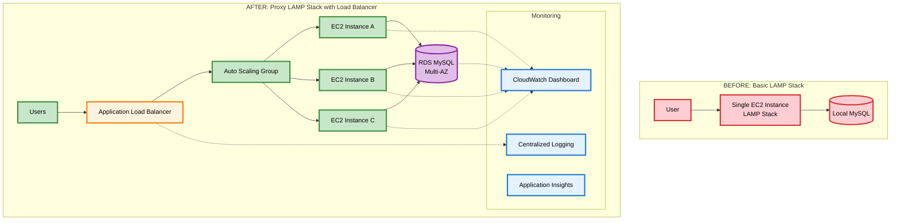
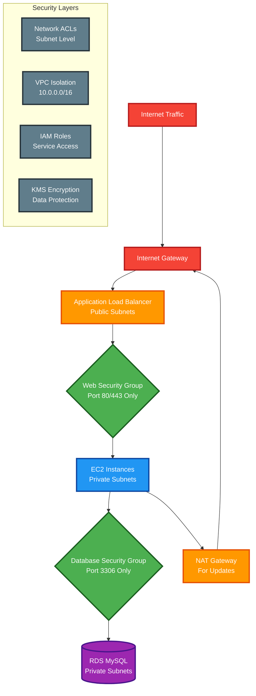
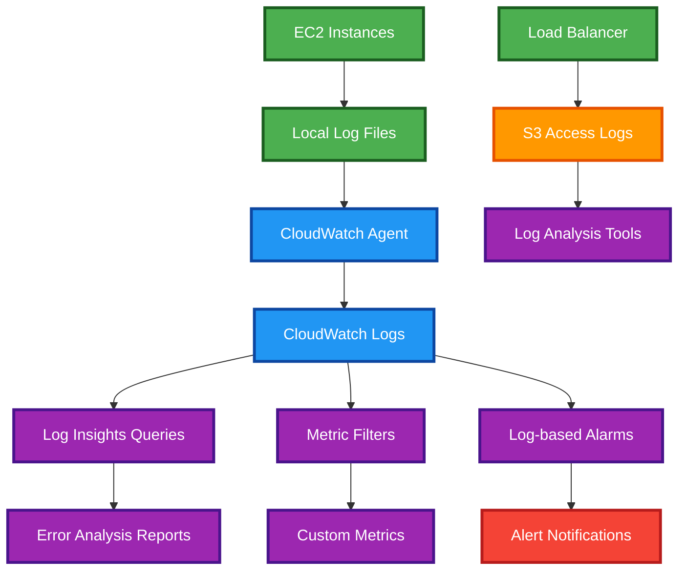
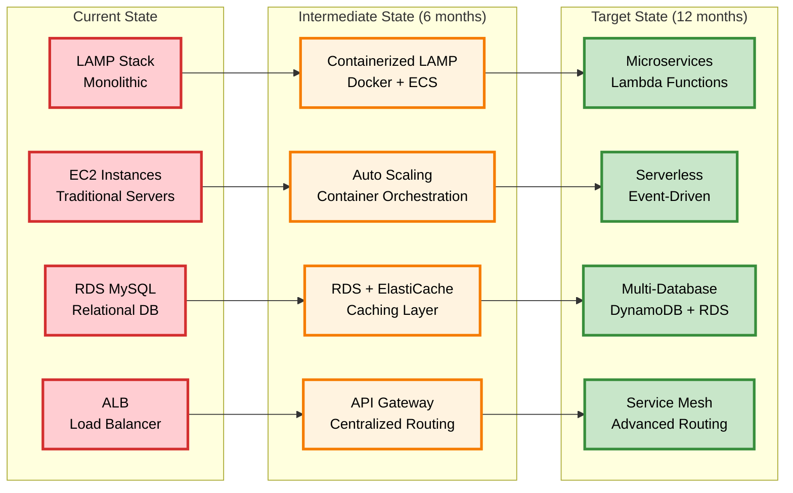

# Proxy LAMP Stack - Complete Deployment Summary

## Overview of Changes

This document summarizes all the changes made to transform the basic LAMP stack application into a highly available, load-balanced, and comprehensively monitored proxy architecture on AWS.

---

## Key Architecture Changes

### Before: Basic LAMP Stack
- Single EC2 instance
- Local MySQL database
- Direct internet access
- Basic monitoring

### After: Proxy LAMP Stack with Load Balancer
- **Application Load Balancer** for traffic distribution
- **Auto Scaling Group** (2-6 instances) for high availability
- **RDS MySQL** for managed database service
- **Multi-AZ deployment** across availability zones
- **Comprehensive monitoring** with CloudWatch and Application Insights
- **Centralized logging** with structured log analysis
- **Enhanced security** with VPC isolation and multiple security groups

---

## Architecture Comparison Diagram



---

## New and Updated Files

### 1. Infrastructure Changes (Terraform)

#### **NEW MODULES CREATED:**
- **`terraform/modules/load_balancer/`** - Application Load Balancer configuration
- **`terraform/modules/database/`** - RDS MySQL setup with backups and monitoring
- **`terraform/modules/monitoring/`** - CloudWatch dashboards, alarms, and log management

#### **UPDATED MODULES:**
- **`terraform/modules/vpc/`** - Multi-AZ VPC with NAT gateways
- **`terraform/modules/security/`** - Multiple security groups for different tiers
- **`terraform/modules/compute/`** - Auto Scaling Group with launch templates

#### **CONFIGURATION UPDATES:**
- **`terraform/main.tf`** - Orchestrates all new modules
- **`terraform/variables.tf`** - Added variables for new components
- **`terraform/outputs.tf`** - Comprehensive outputs for monitoring
- **`terraform/userdata.sh`** - Enhanced EC2 initialization script

### 2. Application Updates

#### **UPDATED FILES:**
- **`app/index.php`** - Enhanced UI with system information and metrics
- **`app/config.php`** - RDS connection support with error handling
- **`app/styles.css`** - New color scheme and responsive components

#### **NEW FILES:**
- **`app/health.php`** - Comprehensive health check endpoint for load balancer
- **`monitoring/cloudwatch-agent.json`** - CloudWatch agent configuration
- **`monitoring/custom-metrics.sh`** - Custom application metrics collection

### 3. DevOps and Automation

#### **UPDATED FILES:**
- **`.github/workflows/deploy.yml`** - Enhanced CI/CD for multi-instance deployment

#### **NEW FILES:**
- **`scripts/deploy.sh`** - Local deployment helper script
- **`.gitignore`** - Comprehensive ignore rules for all technologies
- **`DEPLOYMENT_SUMMARY.md`** - This documentation file

---

## Infrastructure Components Added

### Load Balancing Layer
```yaml
Application Load Balancer Configuration:
  Health Checks:
    Path: /health.php
    Interval: 30 seconds
    Timeout: 5 seconds
    Healthy Threshold: 2
    Unhealthy Threshold: 3
  
  Features:
    - SSL termination ready
    - Access logging to S3
    - WAF integration (optional)
    - Cross-zone load balancing

Target Groups:
  Deregistration Delay: 30 seconds
  Protocol: HTTP
  Port: 80
  Health Check Protocol: HTTP
```

### Auto Scaling Configuration
```yaml
Auto Scaling Group Settings:
  Minimum Instances: 2
  Maximum Instances: 6
  Desired Capacity: 2
  Health Check Type: ELB + EC2
  Health Check Grace Period: 300 seconds
  Termination Policy: OldestInstance

Scaling Policies:
  Target Tracking Policy:
    Target Value: 50% CPU utilization
    Scale Out Cooldown: 300 seconds
    Scale In Cooldown: 300 seconds
  
  Simple Scaling Policies:
    Scale Up Trigger: CPU > 70%
    Scale Down Trigger: CPU < 30%
    Adjustment Type: ChangeInCapacity
    Scaling Adjustment: ±1 instance
```

### Database Migration
```yaml
RDS MySQL 8.0 Configuration:
  Instance Class: db.t3.micro
  Storage: 20GB gp3 (encrypted)
  Multi-AZ: Optional (recommended for production)
  
  Backup Settings:
    Backup Retention Period: 7 days
    Backup Window: 03:00-04:00 UTC
    Maintenance Window: sun:04:00-sun:05:00 UTC
  
  Performance:
    Parameter Groups: Optimized for web workloads
    Enhanced Monitoring: Enabled (60-second granularity)
    Performance Insights: Enabled (7-day retention)
  
  Security:
    VPC Security Groups: Database tier isolation
    Subnet Group: Private subnets only
    Encryption: KMS encryption at rest
```

### Monitoring Stack
```yaml
CloudWatch Components:
  Dashboard Widgets:
    - Load Balancer Metrics (4 widgets)
    - Auto Scaling Metrics (3 widgets)
    - Database Metrics (4 widgets)
    - Application Metrics (3 widgets)
  
  Alarms:
    - High CPU Utilization (Warning: >80%, Critical: >90%)
    - High Error Rate (Critical: >5%)
    - Low Healthy Hosts (Critical: <2)
    - Database CPU High (Warning: >80%)
    - Database Connection High (Warning: >80%)
    - Disk Space Low (Warning: <20%)
  
  Log Groups:
    - /aws/ec2/apache-access (Retention: 14 days)
    - /aws/ec2/apache-error (Retention: 14 days)
    - /aws/ec2/application (Retention: 7 days)
  
  SNS Topics:
    - proxy-lamp-alerts-critical
    - proxy-lamp-alerts-warning

Application Insights:
  Automatic Discovery: Enabled
  Resource Monitoring: All EC2, RDS, ALB resources
  Performance Tracking: Response time, error rate, throughput
  Anomaly Detection: Machine learning-based detection
```

---

## Security Enhancements

### Network Security Architecture



### Security Implementation Details

#### **Network Security**
- **VPC Isolation**: Dedicated VPC (10.0.0.0/16) with public/private subnets
- **Multi-Layer Security**: Security Groups + Network ACLs
- **Least Privilege**: Separate security groups for ALB, web, and database tiers
- **Private Database**: RDS accessible only from web tier

#### **Access Control**
- **IAM Roles**: EC2 instances use roles instead of access keys
- **Secrets Management**: Database credentials in AWS Secrets Manager
- **SSH Key Management**: Automated key pair generation and rotation
- **Instance Metadata v2**: Enhanced metadata service security

#### **Data Protection**
- **Encryption at Rest**: EBS volumes and RDS encrypted with AWS KMS
- **Encryption in Transit**: SSL/TLS for all communications
- **Database Security**: Network isolation and access controls
- **Backup Encryption**: Automated encrypted backups with 7-day retention

---

## Monitoring and Observability

### Key Metrics Tracked

#### **Load Balancer Metrics**
```yaml
Request Metrics:
  - RequestCount: Total requests per minute
  - TargetResponseTime: Average response time
  - HTTPCode_Target_2XX_Count: Successful responses
  - HTTPCode_Target_4XX_Count: Client errors
  - HTTPCode_Target_5XX_Count: Server errors

Connection Metrics:
  - ActiveConnectionCount: Current active connections
  - NewConnectionCount: New connections per minute
  - RejectedConnectionCount: Rejected connections
  - TargetConnectionErrorCount: Connection errors
```

#### **Auto Scaling Metrics**
```yaml
Instance Metrics:
  - GroupMinSize: Minimum configured instances
  - GroupMaxSize: Maximum configured instances
  - GroupDesiredCapacity: Target instance count
  - GroupInServiceInstances: Healthy running instances
  - GroupTotalInstances: All instances (any state)

Scaling Metrics:
  - CPUUtilization: Average CPU across instances
  - NetworkIn/NetworkOut: Network traffic
  - DiskReadOps/DiskWriteOps: Disk I/O operations
  - StatusCheckFailed: Instance health status
```

#### **Database Metrics**
```yaml
Performance Metrics:
  - CPUUtilization: Database CPU usage
  - DatabaseConnections: Active connections
  - FreeableMemory: Available memory
  - ReadLatency/WriteLatency: Query response times
  - ReadIOPS/WriteIOPS: Disk operations per second

Storage Metrics:
  - FreeStorageSpace: Available disk space
  - FreeLocalStorage: Temporary storage space
  - SwapUsage: Memory swap utilization
  - BinLogDiskUsage: Binary log disk usage
```

#### **Application Metrics**
```yaml
Custom Metrics:
  - HealthCheckStatus: Application health (0/1)
  - TaskCount: Number of tasks in database
  - ApacheConnections: Active Apache connections
  - PHPErrorRate: PHP errors per minute
  - DatabaseResponseTime: Custom DB query timing
```

### Alerting Strategy

#### **Critical Alerts (Immediate Action Required)**
```yaml
Database Issues:
  - DatabaseConnections > 80% of max_connections
  - CPUUtilization > 90% for 5 minutes
  - FreeStorageSpace < 2GB

Infrastructure Issues:
  - GroupInServiceInstances < 2
  - HTTPCode_Target_5XX_Count > 10 in 5 minutes
  - TargetResponseTime > 5 seconds for 2 minutes

Application Issues:
  - HealthCheckStatus = 0 for any instance
  - All targets unhealthy for load balancer
  - PHPErrorRate > 50 errors/minute
```

#### **Warning Alerts (Monitor Closely)**
```yaml
Performance Warnings:
  - CPUUtilization > 80% for 10 minutes
  - TargetResponseTime > 2 seconds for 5 minutes
  - DatabaseConnections > 60% of max_connections

Capacity Warnings:
  - GroupInServiceInstances < 3 (when scaled up)
  - FreeStorageSpace < 5GB
  - NetworkIn/NetworkOut unusual patterns

System Warnings:
  - StatusCheckFailed for any instance
  - HTTPCode_Target_4XX_Count spike
  - High disk I/O operations
```

#### **Information Alerts (Awareness)**
```yaml
Operational Events:
  - Auto scaling events (scale up/down)
  - Instance launches/terminations
  - Deployment completions
  - Configuration changes
  - Backup completions
```

### Logging Architecture



#### **Log Collection Details**
```yaml
Log Types and Retention:
  Apache Access Logs:
    Location: /var/log/apache2/access.log
    Format: Combined log format
    Retention: 14 days
    Analysis: Request patterns, response codes, user agents
  
  Apache Error Logs:
    Location: /var/log/apache2/error.log
    Format: Standard error format
    Retention: 14 days
    Analysis: Server errors, configuration issues
  
  Application Logs:
    Location: /var/log/proxy-lamp-app.log
    Format: JSON structured logs
    Retention: 7 days
    Analysis: Business logic errors, performance metrics
  
  System Logs:
    Location: /var/log/cloud-init-output.log
    Format: Plain text
    Retention: 7 days
    Analysis: Deployment issues, initialization problems
  
  Load Balancer Logs:
    Location: S3 bucket (alb-access-logs)
    Format: Standard ALB format
    Retention: 30 days
    Analysis: Traffic patterns, geographic distribution
```

---

## Performance Optimizations

### Application Level Improvements

#### **PHP Optimizations**
```yaml
OpCache Configuration:
  opcache.enable: 1
  opcache.memory_consumption: 256MB
  opcache.interned_strings_buffer: 16MB
  opcache.max_accelerated_files: 4000
  opcache.validate_timestamps: 0 (production)
  opcache.revalidate_freq: 0
  opcache.enable_cli: 1

Connection Pooling:
  MySQL Persistent Connections: Enabled
  Connection Timeout: 30 seconds
  Max Connections Per Instance: 100
  Connection Retry Logic: 3 attempts with backoff
```

#### **Database Optimizations**
```yaml
MySQL Parameter Tuning:
  innodb_buffer_pool_size: 75% of available memory
  max_connections: 1000
  innodb_log_file_size: 256MB
  innodb_flush_log_at_trx_commit: 1
  slow_query_log: 1
  long_query_time: 2
  
Query Optimizations:
  - Added database indexes for task queries
  - Implemented prepared statements
  - Connection pooling and reuse
  - Query result caching where appropriate
```

### Infrastructure Level Improvements

#### **Auto Scaling Optimization**
```yaml
Scaling Configuration:
  Target CPU Utilization: 50%
  Scale Out Cooldown: 300 seconds
  Scale In Cooldown: 300 seconds
  Warmup Time: 300 seconds
  
Instance Optimization:
  Instance Type: t3.micro (burstable performance)
  EBS Optimization: Enabled
  Detailed Monitoring: Enabled
  Placement Group: None (cost optimization)
```

#### **Load Balancer Optimization**
```yaml
ALB Configuration:
  Idle Timeout: 60 seconds
  Deregistration Delay: 30 seconds
  Health Check Interval: 30 seconds
  Cross-Zone Load Balancing: Enabled
  
Listener Rules:
  HTTP to HTTPS Redirect: Configured
  Default Action: Forward to target group
  Health Check: /health.php
```

#### **Network Optimization**
```yaml
VPC Configuration:
  Enhanced Networking: Enabled where supported
  Placement Groups: Considered for high-performance workloads
  Instance Types: Selected for network performance
  
Security Group Rules:
  Minimal required ports only
  Source-specific rules where possible
  Regular review and cleanup
```

---

## Cost Considerations

### Detailed Cost Breakdown (eu-central-1)

#### **Monthly Cost Estimates**
```yaml
Compute Resources:
  EC2 Instances:
    Type: t3.micro × 2 instances
    On-Demand Cost: ~$8.50 per instance
    Monthly Total: ~$17.00
    Free Tier Eligible: Yes (first 12 months)
  
  Auto Scaling:
    Additional Instances: t3.micro × 0-4 (variable)
    Average Additional Cost: ~$17.00 (assuming 2 avg)
    Peak Usage Cost: ~$34.00 (6 instances)

Database Resources:
  RDS MySQL:
    Type: db.t3.micro
    Monthly Cost: ~$13.00
    Storage (20GB): ~$2.30
    Backup Storage: ~$1.00
    Total RDS: ~$16.30
    Free Tier Eligible: Yes (first 12 months)

Network Resources:
  Application Load Balancer:
    Fixed Cost: $16.20 per month
    Data Processing: $0.008 per GB
    Average Monthly: ~$18.00
  
  NAT Gateways:
    NAT Gateway × 2: $45.00 × 2 = $90.00
    Data Processing: $0.045 per GB
    Average Monthly: ~$95.00

Monitoring and Storage:
  CloudWatch:
    Metrics: ~$3.00
    Logs Ingestion: ~$1.00
    Dashboard: ~$3.00
    Total: ~$7.00
  
  S3 Storage:
    ALB Logs: ~$1.00
    Terraform State: ~$0.50
    Total: ~$1.50

Data Transfer:
  Internet Gateway: ~$5.00
  Cross-AZ Transfer: ~$2.00
  Total: ~$7.00

TOTAL ESTIMATED MONTHLY COST: ~$162.80
```

### Cost Optimization Strategies

#### **Development Environment**
```yaml
Cost Reduction Options:
  NAT Instances vs NAT Gateways:
    Savings: ~$85/month
    Trade-off: Manual management, lower availability
  
  Single AZ Deployment:
    Savings: ~$50/month (1 NAT Gateway)
    Trade-off: Reduced availability
  
  Scheduled Scaling:
    Business Hours: 6 AM - 6 PM (4 instances)
    Off Hours: 6 PM - 6 AM (2 instances)
    Weekend: Minimal (2 instances)
    Estimated Savings: ~$25/month
  
  Reserved Instances:
    1-Year Term: ~30% savings
    3-Year Term: ~50% savings
    Applicable to: EC2 and RDS instances
```

#### **Production Environment**
```yaml
Long-term Optimization:
  Reserved Instance Strategy:
    EC2 Reserved Instances: 1-year term for baseline capacity
    RDS Reserved Instances: 1-year term for database
    Estimated Annual Savings: ~$600
  
  Spot Instance Integration:
    Use Cases: Development, testing, batch processing
    Potential Savings: Up to 70% for applicable workloads
    Implementation: Mixed instance types in ASG
  
  Resource Right-sizing:
    Regular Review: Monthly cost and performance analysis
    CloudWatch Metrics: CPU, memory, network utilization
    Recommendations: AWS Trusted Advisor insights
```

---

## Deployment Instructions

### Prerequisites Checklist

#### **Required Tools and Access**
```yaml
AWS Account Setup:
  - AWS Account with administrative access
  - IAM User with programmatic access
  - AWS CLI v2 installed and configured
  - Appropriate service quotas for EC2, RDS, VPC

Development Environment:
  - Terraform >= 1.5.0
  - Git version control
  - SSH client
  - Text editor/IDE

GitHub Repository:
  - GitHub account with repository access
  - GitHub Actions enabled
  - Repository secrets configured
  - SSH key pair generated
```

#### **AWS Permissions Matrix**
```yaml
Required IAM Permissions:
  EC2 Services:
    - ec2:* (instances, security groups, key pairs)
    - autoscaling:* (auto scaling groups, policies)
    - elasticloadbalancing:* (load balancers, target groups)
  
  VPC Services:
    - vpc:* (VPC, subnets, route tables, gateways)
    - route53:* (if using custom domains)
  
  Database Services:
    - rds:* (instances, parameter groups, snapshots)
    - rds-db:connect (for IAM database authentication)
  
  Monitoring Services:
    - cloudwatch:* (metrics, alarms, dashboards)
    - logs:* (log groups, streams, events)
    - sns:* (topics, subscriptions)
    - applicationinsights:* (application monitoring)
  
  Storage and Secrets:
    - s3:* (buckets for state and logs)
    - secretsmanager:* (database credentials)
    - kms:* (encryption keys)
  
  IAM Services:
    - iam:* (roles, policies, instance profiles)
```

### Quick Deployment Guide

#### **Step 1: Repository Setup**
```bash
# Clone the repository
git clone https://github.com/your-username/proxy-lamp-stack-application.git
cd proxy-lamp-stack-application

# Generate SSH key pair for EC2 access
ssh-keygen -t rsa -b 2048 -f proxy-lamp-keypair -N ""
chmod 600 proxy-lamp-keypair

# Display public key for GitHub secrets
echo "Public Key for GitHub Secrets:"
cat proxy-lamp-keypair.pub
```

#### **Step 2: S3 Backend Setup**
```bash
# Create unique bucket name
BUCKET_NAME="proxy-lamp-tfstate-$(whoami)-$(date +%s)"
echo "Terraform State Bucket: $BUCKET_NAME"

# Create S3 bucket for Terraform state
aws s3 mb s3://$BUCKET_NAME --region eu-central-1

# Enable versioning for state file protection
aws s3api put-bucket-versioning \
  --bucket $BUCKET_NAME \
  --versioning-configuration Status=Enabled

# Enable server-side encryption
aws s3api put-bucket-encryption \
  --bucket $BUCKET_NAME \
  --server-side-encryption-configuration \
  '{"Rules":[{"ApplyServerSideEncryptionByDefault":{"SSEAlgorithm":"AES256"}}]}'

# Update Terraform configuration
sed -i "s/your-terraform-state-bucket/$BUCKET_NAME/g" terraform/main.tf
```

#### **Step 3: GitHub Secrets Configuration**
```yaml
Required GitHub Repository Secrets:
  AWS_ACCESS_KEY_ID:
    Value: Your AWS access key ID
    Usage: Terraform authentication
  
  AWS_SECRET_ACCESS_KEY:
    Value: Your AWS secret access key
    Usage: Terraform authentication
  
  EC2_PUBLIC_KEY:
    Value: Contents of proxy-lamp-keypair.pub
    Usage: EC2 instance SSH access
  
  EC2_PRIVATE_KEY:
    Value: Contents of proxy-lamp-keypair (private key)
    Usage: Deployment script access
  
  DB_PASSWORD:
    Value: Strong database password (optional)
    Usage: RDS MySQL root password
    Default: Auto-generated if not provided
    
Configuration Steps:
  1. Go to GitHub Repository → Settings
  2. Select "Secrets and variables" → "Actions"
  3. Click "New repository secret"
  4. Add each secret with exact names above
```

#### **Step 4: Deployment Execution**
```bash
# Commit all changes
git add .
git commit -m "Initial proxy LAMP stack deployment configuration"

# Push to trigger GitHub Actions deployment
git push origin main

# Monitor deployment progress
echo "Deployment initiated. Monitor progress at:"
echo "https://github.com/your-username/proxy-lamp-stack-application/actions"
```

### Manual Deployment (Alternative)

#### **Local Terraform Deployment**
```bash
# Navigate to Terraform directory
cd terraform

# Initialize Terraform with backend configuration
terraform init

# Validate configuration syntax
terraform validate

# Plan deployment with variables
terraform plan \
  -var="public_key=$(cat ../proxy-lamp-keypair.pub)" \
  -var="db_password=YourSecurePassword123!" \
  -out=deployment.tfplan

# Review the plan output carefully
# Apply the deployment
terraform apply deployment.tfplan

# Display important outputs
terraform output
```

#### **Post-Deployment Verification**
```bash
# Get load balancer DNS name
ALB_DNS=$(terraform output -raw load_balancer_dns)
echo "Application URL: http://$ALB_DNS"

# Wait for instances to be healthy (5-10 minutes)
echo "Waiting for application to be ready..."
for i in {1..20}; do
  if curl -s "http://$ALB_DNS/health.php" | grep -q '"status":"healthy"'; then
    echo "Application is healthy!"
    break
  fi
  echo "Attempt $i/20: Application not ready yet..."
  sleep 30
done

# Test application functionality
curl -s "http://$ALB_DNS" | grep -q "Task Management" && echo "Application accessible!"
```

---

## Health Checks and Monitoring

### Health Check Endpoints

#### **Application Health Check**
```yaml
Primary Endpoint: http://<load-balancer-dns>/health.php

Response Format:
  {
    "status": "healthy|degraded|unhealthy",
    "timestamp": "2025-07-02T10:30:00Z",
    "server": "instance-id",
    "checks": {
      "database": {
        "status": "healthy|unhealthy",
        "response_time_ms": 45.2,
        "connection_count": 12
      },
      "disk": {
        "status": "healthy|warning|critical",
        "usage_percent": 34.7,
        "free_space_gb": 13.2
      },
      "apache": {
        "status": "healthy|unhealthy",
        "load_average": [0.8, 0.6, 0.5],
        "active_connections": 23
      },
      "php": {
        "status": "healthy|unhealthy",
        "memory_usage_mb": 128,
        "opcache_status": "enabled"
      }
    }
  }

Health Status Determination:
  - healthy: All checks pass
  - degraded: Non-critical issues (high disk usage, etc.)
  - unhealthy: Critical issues (DB connection failure, etc.)
```

#### **Load Balancer Health Check Configuration**
```yaml
Target Group Health Check:
  Protocol: HTTP
  Port: 80
  Path: /health.php
  Interval: 30 seconds
  Timeout: 5 seconds
  Healthy Threshold: 2 consecutive successes
  Unhealthy Threshold: 3 consecutive failures
  Matcher: 200 HTTP status code

Health Check Evaluation:
  - Instance marked healthy: After 2 successful checks (1 minute)
  - Instance marked unhealthy: After 3 failed checks (1.5 minutes)
  - Automatic instance replacement: After unhealthy determination
```

### Monitoring Dashboard Access

#### **CloudWatch Dashboard URLs**
```yaml
Main Dashboard:
  URL: https://eu-central-1.console.aws.amazon.com/cloudwatch/home?region=eu-central-1#dashboards:name=proxy-lamp-stack-dashboard
  
Dashboard Sections:
  Load Balancer Metrics:
    - Request count and rate
    - Response time percentiles
    - HTTP status code distribution
    - Target health status
  
  Auto Scaling Metrics:
    - Instance count over time
    - CPU utilization across instances
    - Scaling activities timeline
    - Network I/O patterns
  
  Database Metrics:
    - CPU and memory utilization
    - Connection count and query performance
    - Storage usage and growth
    - Read/write latency trends
  
  Application Metrics:
    - Custom health check status
    - Task count and user activity
    - Error rates and response times
    - Apache performance metrics
```

#### **Application Insights Access**
```yaml
Application Insights URL:
  https://eu-central-1.console.aws.amazon.com/systems-manager/appinsights/applications

Features Available:
  Automatic Discovery:
    - All application components
    - Resource dependencies
    - Performance baselines
  
  Performance Monitoring:
    - Application map visualization
    - Performance anomaly detection
    - Error rate tracking
    - Resource correlation analysis
  
  Troubleshooting:
    - Root cause analysis
    - Performance insights
    - Resource optimization recommendations
    - Issue timeline correlation
```

### Key Monitoring URLs and Commands

#### **Quick Status Checks**
```bash
# Application accessibility
curl -I http://<load-balancer-dns>

# Detailed health check
curl -s http://<load-balancer-dns>/health.php | jq '.'

# Load balancer target health
aws elbv2 describe-target-health \
  --target-group-arn <target-group-arn> \
  --region eu-central-1

# Auto scaling group status
aws autoscaling describe-auto-scaling-groups \
  --auto-scaling-group-names proxy-lamp-asg \
  --region eu-central-1

# RDS instance status
aws rds describe-db-instances \
  --db-instance-identifier proxy-lamp-mysql \
  --region eu-central-1
```

#### **Performance Monitoring Commands**
```bash
# CloudWatch metrics query
aws cloudwatch get-metric-statistics \
  --namespace AWS/ApplicationELB \
  --metric-name RequestCount \
  --dimensions Name=LoadBalancer,Value=app/proxy-lamp-alb/* \
  --start-time 2025-07-02T09:00:00Z \
  --end-time 2025-07-02T10:00:00Z \
  --period 300 \
  --statistics Sum \
  --region eu-central-1

# Log insights query for errors
aws logs start-query \
  --log-group-name /aws/ec2/apache-error \
  --start-time $(date -d '1 hour ago' +%s) \
  --end-time $(date +%s) \
  --query-string 'fields @timestamp, @message | filter @message like /ERROR/ | sort @timestamp desc | limit 20' \
  --region eu-central-1
```

---

## Troubleshooting Common Issues

### Load Balancer Issues

#### **Health Check Failures**
```yaml
Problem: Targets showing as unhealthy in load balancer
Symptoms:
  - HTTP 502/503 errors from load balancer
  - Targets marked as unhealthy in target group
  - Application intermittently accessible

Diagnostic Steps:
  1. Check target group health:
     aws elbv2 describe-target-health --target-group-arn <arn>
  
  2. Verify health endpoint directly:
     curl -v http://<instance-ip>/health.php
  
  3. Check security group rules:
     aws ec2 describe-security-groups --group-ids <web-sg-id>
  
  4. Review application logs:
     aws logs tail /aws/ec2/apache-error --follow

Common Causes and Solutions:
  - Security group blocking ALB access:
    Solution: Ensure web security group allows HTTP (80) from ALB security group
  
  - Health endpoint returning errors:
    Solution: Check database connectivity, disk space, Apache status
  
  - Long application startup time:
    Solution: Increase health check timeout or reduce check frequency
  
  - Instance not ready during launch:
    Solution: Increase health check grace period in ASG settings
```

#### **High Response Times**
```yaml
Problem: Load balancer reporting high response times
Symptoms:
  - TargetResponseTime metric consistently > 2 seconds
  - Users reporting slow application performance
  - TimeOuts in application logs

Diagnostic Steps:
  1. Check CloudWatch metrics for bottlenecks:
     - CPU utilization per instance
     - Database response times
     - Network I/O patterns
  
  2. Analyze application logs for slow queries:
     aws logs insights start-query --query-string 'fields @timestamp, @message | filter @message like /slow/ | sort @timestamp desc'
  
  3. Review database performance insights:
     Check RDS Performance Insights dashboard
  
  4. Test individual instance performance:
     for ip in $(aws ec2 describe-instances --query 'Reservations[].Instances[?State.Name==`running`].PrivateIpAddress' --output text); do
       time curl -s http://$ip/health.php > /dev/null
     done

Optimization Solutions:
  - Scale up if CPU consistently high:
    Adjust target tracking scaling policy threshold
  
  - Optimize database queries:
    Enable slow query log and analyze problematic queries
  
  - Increase instance size:
    Change from t3.micro to t3.small for better performance
  
  - Implement application caching:
    Add Redis/ElastiCache for session and query caching
```

### Auto Scaling Issues

#### **Scaling Not Triggering**
```yaml
Problem: Auto Scaling Group not scaling despite high load
Symptoms:
  - CPU metrics showing > 70% but no scale-out
  - Manual scaling works but automatic doesn't
  - Scaling activities show no recent actions

Diagnostic Steps:
  1. Check scaling policies:
     aws autoscaling describe-policies --auto-scaling-group-name proxy-lamp-asg
  
  2. Verify CloudWatch alarms:
     aws cloudwatch describe-alarms --alarm-names proxy-lamp-cpu-high
  
  3. Review scaling activities:
     aws autoscaling describe-scaling-activities --auto-scaling-group-name proxy-lamp-asg --max-items 10
  
  4. Check service quotas:
     aws service-quotas get-service-quota --service-code ec2 --quota-code L-1216C47A

Common Issues and Solutions:
  - Cooldown period preventing scaling:
    Solution: Review and adjust cooldown periods in scaling policies
  
  - Insufficient EC2 capacity:
    Solution: Try different instance types or availability zones
  
  - Service quota limits reached:
    Solution: Request quota increase through AWS Support
  
  - CloudWatch alarm not triggering:
    Solution: Verify alarm configuration and metric data availability
```

#### **Instances Failing to Launch**
```yaml
Problem: New instances launched by ASG fail to become healthy
Symptoms:
  - Instances launched but terminated quickly
  - Health checks never pass for new instances
  - ASG keeps trying to maintain desired capacity

Diagnostic Steps:
  1. Check launch template configuration:
     aws ec2 describe-launch-templates --launch-template-names proxy-lamp-template
  
  2. Review instance system logs:
     aws ec2 get-console-output --instance-id <instance-id>
  
  3. Check cloud-init logs on failed instances:
     aws ssm send-command --document-name "AWS-RunShellScript" --targets "Key=instanceids,Values=<instance-id>" --parameters 'commands=["cat /var/log/cloud-init-output.log"]'
  
  4. Verify security group and subnet configuration:
     Check that instances can reach internet for package installation

Common Causes and Solutions:
  - User data script failures:
    Solution: Debug and fix user data script issues
  
  - Security group blocking outbound traffic:
    Solution: Ensure outbound rules allow HTTPS (443) and HTTP (80)
  
  - Subnet has no route to internet:
    Solution: Verify NAT gateway configuration and route tables
  
  - AMI compatibility issues:
    Solution: Update to latest Amazon Linux 2 AMI
```

### Database Issues

#### **Connection Problems**
```yaml
Problem: Application cannot connect to RDS database
Symptoms:
  - Database health checks failing
  - "Connection refused" errors in application logs
  - High connection count or timeout errors

Diagnostic Steps:
  1. Check RDS instance status:
     aws rds describe-db-instances --db-instance-identifier proxy-lamp-mysql
  
  2. Verify security group rules:
     aws ec2 describe-security-groups --group-ids <db-security-group-id>
  
  3. Test connectivity from EC2:
     mysql -h <rds-endpoint> -u admin -p -e "SELECT 1"
  
  4. Check database logs:
     aws rds describe-db-log-files --db-instance-identifier proxy-lamp-mysql

Common Issues and Solutions:
  - Database security group blocking access:
    Solution: Ensure DB security group allows MySQL (3306) from web security group
  
  - Wrong database endpoint:
    Solution: Verify RDS endpoint in application configuration
  
  - Database password mismatch:
    Solution: Check Secrets Manager for correct password
  
  - Connection pool exhaustion:
    Solution: Optimize application connection handling
```

#### **Performance Issues**
```yaml
Problem: Database queries running slowly
Symptoms:
  - High database CPU utilization
  - Slow query log showing problematic queries
  - Application timeouts during database operations

Diagnostic Steps:
  1. Check Performance Insights:
     Review top SQL statements and wait events
  
  2. Analyze slow query log:
     aws rds download-db-log-file-portion --db-instance-identifier proxy-lamp-mysql --log-file-name slowquery/mysql-slowquery.log
  
  3. Monitor key metrics:
     - CPU utilization
     - Database connections
     - Read/write latency
  
  4. Check for lock contention:
     Review Performance Insights for lock waits

Optimization Solutions:
  - Add database indexes:
    CREATE INDEX idx_task_created ON tasks(created_at);
  
  - Optimize queries:
    Use EXPLAIN to analyze query execution plans
  
  - Increase database resources:
    Scale up to larger instance class (db.t3.small)
  
  - Tune database parameters:
    Adjust innodb_buffer_pool_size and other parameters
```

### Monitoring Issues

#### **Missing Metrics**
```yaml
Problem: CloudWatch not receiving metrics from instances
Symptoms:
  - Empty or sparse data in CloudWatch dashboards
  - Missing custom metrics
  - Alarms in "Insufficient Data" state

Diagnostic Steps:
  1. Check CloudWatch agent status:
     sudo systemctl status amazon-cloudwatch-agent
  
  2. Review agent configuration:
     sudo cat /opt/aws/amazon-cloudwatch-agent/etc/amazon-cloudwatch-agent.json
  
  3. Check agent logs:
     sudo tail -f /opt/aws/amazon-cloudwatch-agent/logs/amazon-cloudwatch-agent.log
  
  4. Verify IAM permissions:
     aws sts get-caller-identity

Solutions:
  - Restart CloudWatch agent:
    sudo systemctl restart amazon-cloudwatch-agent
  
  - Reconfigure agent:
    sudo /opt/aws/amazon-cloudwatch-agent/bin/amazon-cloudwatch-agent-ctl -m ec2 -c file:/opt/aws/amazon-cloudwatch-agent/etc/amazon-cloudwatch-agent.json -a fetch-config
  
  - Check IAM role permissions:
    Ensure CloudWatchAgentServerPolicy is attached
  
  - Verify network connectivity:
    Test HTTPS connectivity to CloudWatch endpoints
```

---

## Cleanup Instructions

### Complete Infrastructure Cleanup

#### **Automated Cleanup with Terraform**
```bash
# Method 1: Complete destruction using Terraform
cd terraform

# Plan the destruction (review what will be deleted)
terraform plan -destroy \
  -var="public_key=$(cat ../proxy-lamp-keypair.pub)" \
  -var="db_password=YourDatabasePassword" \
  -out=destroy.tfplan

# Execute the destruction plan
terraform apply destroy.tfplan

# Alternative: Direct destroy command
terraform destroy \
  -var="public_key=$(cat ../proxy-lamp-keypair.pub)" \
  -var="db_password=YourDatabasePassword" \
  -auto-approve

# Verify all resources are deleted
terraform show
```

#### **Manual Cleanup (If Terraform Fails)**
```bash
# Step 1: Delete Auto Scaling Group (forces instance termination)
aws autoscaling update-auto-scaling-group \
  --auto-scaling-group-name proxy-lamp-asg \
  --min-size 0 --max-size 0 --desired-capacity 0

aws autoscaling delete-auto-scaling-group \
  --auto-scaling-group-name proxy-lamp-asg \
  --force-delete

# Step 2: Delete Load Balancer
ALB_ARN=$(aws elbv2 describe-load-balancers --names proxy-lamp-alb --query 'LoadBalancers[0].LoadBalancerArn' --output text)
aws elbv2 delete-load-balancer --load-balancer-arn $ALB_ARN

# Step 3: Delete Target Groups
TG_ARN=$(aws elbv2 describe-target-groups --names proxy-lamp-tg --query 'TargetGroups[0].TargetGroupArn' --output text)
aws elbv2 delete-target-group --target-group-arn $TG_ARN

# Step 4: Delete RDS Instance
aws rds delete-db-instance \
  --db-instance-identifier proxy-lamp-mysql \
  --skip-final-snapshot \
  --delete-automated-backups

# Step 5: Wait for RDS deletion to complete
aws rds wait db-instance-deleted --db-instance-identifier proxy-lamp-mysql

# Step 6: Delete Launch Template
aws ec2 delete-launch-template --launch-template-name proxy-lamp-template

# Step 7: Delete Security Groups (in dependency order)
aws ec2 delete-security-group --group-id <web-security-group-id>
aws ec2 delete-security-group --group-id <db-security-group-id>
aws ec2 delete-security-group --group-id <alb-security-group-id>

# Step 8: Delete Subnets
aws ec2 delete-subnet --subnet-id <private-subnet-1-id>
aws ec2 delete-subnet --subnet-id <private-subnet-2-id>
aws ec2 delete-subnet --subnet-id <public-subnet-1-id>
aws ec2 delete-subnet --subnet-id <public-subnet-2-id>

# Step 9: Delete NAT Gateways
aws ec2 delete-nat-gateway --nat-gateway-id <nat-gateway-1-id>
aws ec2 delete-nat-gateway --nat-gateway-id <nat-gateway-2-id>

# Step 10: Delete Internet Gateway
aws ec2 detach-internet-gateway --internet-gateway-id <igw-id> --vpc-id <vpc-id>
aws ec2 delete-internet-gateway --internet-gateway-id <igw-id>

# Step 11: Delete VPC
aws ec2 delete-vpc --vpc-id <vpc-id>
```

#### **Resource Verification and Cleanup**
```bash
# List all resources with project tags
aws resourcegroupstaggingapi get-resources \
  --tag-filters Key=Project,Values=proxy-lamp-stack \
  --region eu-central-1

# Check for remaining EC2 instances
aws ec2 describe-instances \
  --filters "Name=tag:Project,Values=proxy-lamp-stack" \
  --query 'Reservations[].Instances[?State.Name!=`terminated`].[InstanceId,State.Name]' \
  --output table

# Check for remaining RDS instances
aws rds describe-db-instances \
  --query 'DBInstances[?contains(DBInstanceIdentifier,`proxy-lamp`)].DBInstanceIdentifier' \
  --output text

# Check for remaining load balancers
aws elbv2 describe-load-balancers \
  --query 'LoadBalancers[?contains(LoadBalancerName,`proxy-lamp`)].LoadBalancerArn' \
  --output text

# Verify VPC deletion
aws ec2 describe-vpcs \
  --filters "Name=tag:Project,Values=proxy-lamp-stack" \
  --query 'Vpcs[].VpcId' \
  --output text
```

### Cost Monitoring and Cleanup

#### **Cost Analysis Before Cleanup**
```bash
# Get current month costs for the project
aws ce get-cost-and-usage \
  --time-period Start=2025-07-01,End=2025-07-02 \
  --granularity MONTHLY \
  --metrics BlendedCost \
  --group-by Type=DIMENSION,Key=SERVICE \
  --filter file://cost-filter.json

# Create cost filter file
cat > cost-filter.json << EOF
{
  "Tags": {
    "Key": "Project",
    "Values": ["proxy-lamp-stack"]
  }
}
EOF

# Detailed cost breakdown by resource
aws ce get-dimension-values \
  --dimension RESOURCE_ID \
  --time-period Start=2025-07-01,End=2025-07-02 \
  --context COST_AND_USAGE
```

#### **Post-Cleanup Verification**
```bash
# Wait 24-48 hours after cleanup, then check for any remaining costs
aws ce get-cost-and-usage \
  --time-period Start=2025-07-02,End=2025-07-03 \
  --granularity DAILY \
  --metrics BlendedCost \
  --group-by Type=DIMENSION,Key=SERVICE

# Check for any recurring charges
aws support describe-cases \
  --language en \
  --include-resolved-cases false
```

### S3 Cleanup (Terraform State and Logs)

#### **Terraform State Bucket Cleanup**
```bash
# List objects in Terraform state bucket
BUCKET_NAME="your-terraform-state-bucket-name"
aws s3 ls s3://$BUCKET_NAME --recursive

# Download final state file (for backup)
aws s3 cp s3://$BUCKET_NAME/proxy-lamp-stack/terraform.tfstate ./final-terraform.tfstate

# Delete all objects in bucket
aws s3 rm s3://$BUCKET_NAME --recursive

# Delete the bucket
aws s3 rb s3://$BUCKET_NAME
```

#### **ALB Access Logs Cleanup**
```bash
# Find ALB logs bucket
ALB_LOGS_BUCKET=$(aws elbv2 describe-load-balancer-attributes \
  --load-balancer-arn $ALB_ARN \
  --query 'Attributes[?Key==`access_logs.s3.bucket`].Value' \
  --output text 2>/dev/null || echo "bucket-not-found")

if [ "$ALB_LOGS_BUCKET" != "bucket-not-found" ]; then
  # List ALB log files
  aws s3 ls s3://$ALB_LOGS_BUCKET --recursive
  
  # Delete ALB logs (optional - consider retention policy)
  aws s3 rm s3://$ALB_LOGS_BUCKET --recursive
  
  # Delete logs bucket if created specifically for this project
  aws s3 rb s3://$ALB_LOGS_BUCKET
fi
```

---

## Success Criteria

### Deployment Success Indicators

#### **Infrastructure Health Checklist**
```yaml
Core Infrastructure:
  ✓ VPC created with public/private subnets in 2 AZs
  ✓ Internet Gateway and NAT Gateways operational
  ✓ Security Groups configured with least privilege access
  ✓ Application Load Balancer accessible from internet
  ✓ Auto Scaling Group maintaining 2+ healthy instances
  ✓ RDS MySQL instance running and accessible from web tier
  ✓ All Terraform outputs showing expected values

Network Connectivity:
  ✓ Load balancer health checks passing (HTTP 200)
  ✓ Database connectivity from all web instances
  ✓ Internet access from private subnets via NAT Gateway
  ✓ Security group rules allowing only required traffic
  ✓ DNS resolution working for RDS endpoint

Application Functionality:
  ✓ Main application accessible via load balancer URL
  ✓ Task creation and deletion working correctly
  ✓ Database operations completing successfully
  ✓ Health check endpoint returning detailed status
  ✓ User interface responsive on multiple devices
  ✓ No JavaScript or PHP errors in browser console

Monitoring and Logging:
  ✓ CloudWatch dashboard populated with real-time metrics
  ✓ All CloudWatch alarms in "OK" or "Alarm" state (not "Insufficient Data")
  ✓ Log groups receiving data from all instances
  ✓ Custom metrics being published correctly
  ✓ SNS topics configured for alert notifications
  ✓ Application Insights discovering and monitoring resources
```

#### **Automated Validation Script**
```bash
#!/bin/bash
# deployment-validation.sh

set -e

echo "=== Proxy LAMP Stack Deployment Validation ==="

# Get outputs from Terraform
cd terraform
ALB_DNS=$(terraform output -raw load_balancer_dns)
DB_ENDPOINT=$(terraform output -raw rds_endpoint)
cd ..

echo "Load Balancer DNS: $ALB_DNS"
echo "Database Endpoint: $DB_ENDPOINT"

# Test 1: Application Accessibility
echo -n "Testing application accessibility... "
if curl -s -o /dev/null -w "%{http_code}" "http://$ALB_DNS" | grep -q "200"; then
    echo "✓ PASS"
else
    echo "✗ FAIL"
    exit 1
fi

# Test 2: Health Check Endpoint
echo -n "Testing health check endpoint... "
HEALTH_RESPONSE=$(curl -s "http://$ALB_DNS/health.php")
if echo "$HEALTH_RESPONSE" | grep -q '"status":"healthy"'; then
    echo "✓ PASS"
else
    echo "✗ FAIL - Health check returned: $HEALTH_RESPONSE"
    exit 1
fi

# Test 3: Database Connectivity
echo -n "Testing database connectivity... "
if echo "$HEALTH_RESPONSE" | grep -q '"database":{"status":"healthy"'; then
    echo "✓ PASS"
else
    echo "✗ FAIL - Database check failed"
    exit 1
fi

# Test 4: Load Balancer Target Health
echo -n "Testing load balancer targets... "
UNHEALTHY_TARGETS=$(aws elbv2 describe-target-health \
    --target-group-arn $(aws elbv2 describe-target-groups --names proxy-lamp-tg --query 'TargetGroups[0].TargetGroupArn' --output text) \
    --query 'TargetHealthDescriptions[?TargetHealth.State!=`healthy`]' \
    --output text)

if [ -z "$UNHEALTHY_TARGETS" ]; then
    echo "✓ PASS"
else
    echo "✗ FAIL - Unhealthy targets found"
    exit 1
fi

# Test 5: Auto Scaling Group Health
echo -n "Testing auto scaling group... "
HEALTHY_INSTANCES=$(aws autoscaling describe-auto-scaling-groups \
    --auto-scaling-group-names proxy-lamp-asg \
    --query 'AutoScalingGroups[0].Instances[?HealthStatus==`Healthy`]' \
    --output text | wc -l)

if [ "$HEALTHY_INSTANCES" -ge 2 ]; then
    echo "✓ PASS ($HEALTHY_INSTANCES healthy instances)"
else
    echo "✗ FAIL - Only $HEALTHY_INSTANCES healthy instances"
    exit 1
fi

# Test 6: CloudWatch Metrics
echo -n "Testing CloudWatch metrics... "
METRIC_COUNT=$(aws cloudwatch list-metrics \
    --namespace "AWS/ApplicationELB" \
    --metric-name RequestCount \
    --query 'length(Metrics)' \
    --output text)

if [ "$METRIC_COUNT" -gt 0 ]; then
    echo "✓ PASS"
else
    echo "✗ FAIL - No CloudWatch metrics found"
    exit 1
fi

echo ""
echo "=== All Deployment Validation Tests Passed! ==="
echo "Application URL: http://$ALB_DNS"
echo "Health Check: http://$ALB_DNS/health.php"
echo ""
```

### Performance Targets

#### **Response Time Benchmarks**
```yaml
Application Performance:
  Target: Average response time < 2 seconds
  Measurement: CloudWatch TargetResponseTime metric
  Acceptable Range: 0.5 - 2.0 seconds
  Critical Threshold: > 5 seconds

Database Performance:
  Target: Query response time < 100ms
  Measurement: Custom application metrics
  Acceptable Range: 20 - 100ms
  Critical Threshold: > 500ms

Load Balancer Performance:
  Target: 99.9% availability (< 1 minute downtime/day)
  Measurement: Target health checks
  Acceptable Range: 99.5% - 99.9%
  Critical Threshold: < 99.0%

Auto Scaling Performance:
  Target: Scale-out within 5 minutes of trigger
  Measurement: Scaling activity timeline
  Acceptable Range: 3 - 10 minutes
  Critical Threshold: > 15 minutes
```

#### **Performance Testing Script**
```bash
#!/bin/bash
# performance-test.sh

echo "=== Performance Testing ==="

ALB_DNS="your-load-balancer-dns"
TEST_DURATION=300  # 5 minutes
CONCURRENT_USERS=10

# Test 1: Response Time Test
echo "Testing response times..."
for i in {1..20}; do
    RESPONSE_TIME=$(curl -o /dev/null -s -w "%{time_total}" "http://$ALB_DNS")
    echo "Request $i: ${RESPONSE_TIME}s"
done

# Test 2: Load Test with Apache Bench
echo "Running load test..."
ab -n 1000 -c $CONCURRENT_USERS "http://$ALB_DNS/" > loadtest_results.txt
cat loadtest_results.txt

# Test 3: Health Check Performance
echo "Testing health check performance..."
for i in {1..10}; do
    HEALTH_TIME=$(curl -o /dev/null -s -w "%{time_total}" "http://$ALB_DNS/health.php")
    echo "Health check $i: ${HEALTH_TIME}s"
done

echo "Performance testing completed. Check loadtest_results.txt for detailed results."
```

### Monitoring Validation

#### **Alert Testing**
```yaml
Critical Alert Tests:
  High CPU Test:
    Method: Generate CPU load on instances
    Expected: CloudWatch alarm triggers within 5 minutes
    Recovery: CPU load stops, alarm clears within 10 minutes
  
  Database Connection Test:
    Method: Temporarily block database access
    Expected: Health checks fail, targets marked unhealthy
    Recovery: Access restored, targets healthy within 2 minutes
  
  Instance Failure Test:
    Method: Terminate one instance manually
    Expected: Auto Scaling launches replacement within 5 minutes
    Recovery: New instance healthy and serving traffic

Monitoring Coverage Test:
  Metrics Collection:
    ✓ All EC2 instances sending metrics
    ✓ RDS metrics being collected
    ✓ Load balancer metrics available
    ✓ Custom application metrics publishing
  
  Log Collection:
    ✓ Apache access logs in CloudWatch
    ✓ Apache error logs in CloudWatch
    ✓ Application logs in CloudWatch
    ✓ System logs being collected
  
  Dashboard Functionality:
    ✓ All dashboard widgets showing data
    ✓ Time range selectors working
    ✓ Drill-down capabilities functional
    ✓ Auto-refresh operating correctly
```

---

## Next Steps and Enhancements

### Immediate Improvements (Week 1-2)

#### **Security Enhancements**
```yaml
SSL/TLS Implementation:
  Action: Request ACM certificate for custom domain
  Benefit: Encrypted traffic and improved SEO
  Implementation:
    - Request SSL certificate through ACM
    - Update load balancer listeners for HTTPS
    - Configure HTTP to HTTPS redirect
    - Update security groups for port 443

WAF Configuration:
  Action: Implement AWS WAF for application protection
  Benefit: Protection against common web attacks
  Implementation:
    - Create WAF web ACL with managed rule groups
    - Configure rate limiting rules
    - Set up geo-blocking if required
    - Associate WAF with Application Load Balancer

Secrets Rotation:
  Action: Implement automatic password rotation
  Benefit: Enhanced security through regular credential updates
  Implementation:
    - Configure Secrets Manager rotation for RDS
    - Update application to retrieve credentials from Secrets Manager
    - Set up rotation schedule (monthly recommended)
```

#### **Performance Optimizations**
```yaml
Caching Layer:
  Action: Implement ElastiCache for Redis
  Benefit: Reduced database load and faster response times
  Implementation:
    - Deploy Redis cluster in private subnets
    - Update application to use Redis for session storage
    - Implement query result caching
    - Configure cache invalidation strategies

Content Delivery Network:
  Action: Set up CloudFront distribution
  Benefit: Global content delivery and reduced origin load
  Implementation:
    - Create CloudFront distribution with ALB as origin
    - Configure caching behaviors for static assets
    - Set up custom domain with SSL certificate
    - Implement cache invalidation strategies

Database Optimization:
  Action: Implement read replicas and connection pooling
  Benefit: Improved database performance and availability
  Implementation:
    - Create read replica in different AZ
    - Update application for read/write split
    - Implement connection pooling with PgBouncer/ProxySQL
    - Configure automated failover
```

### Medium-term Enhancements (Month 1-3)

#### **Advanced Monitoring**
```yaml
Application Performance Monitoring:
  Tools: AWS X-Ray, Custom metrics
  Implementation:
    - Integrate X-Ray tracing in PHP application
    - Set up distributed tracing across components
    - Create performance baselines and anomaly detection
    - Implement business metric tracking

Log Analysis Enhancement:
  Tools: ElasticSearch, Kibana
  Implementation:
    - Deploy managed ElasticSearch cluster
    - Configure log shipping from CloudWatch
    - Create custom dashboards for business insights
    - Set up advanced alerting based on log patterns

Cost Optimization:
  Tools: AWS Cost Explorer, Trusted Advisor
  Implementation:
    - Implement detailed cost allocation tags
    - Set up cost budgets and alerts
    - Regular right-sizing analysis
    - Reserved Instance planning and purchasing
```

#### **DevOps Improvements**
```yaml
Blue/Green Deployments:
  Benefit: Zero-downtime deployments
  Implementation:
    - Create duplicate environment (Green)
    - Implement traffic switching mechanisms
    - Automate testing and validation
    - Create rollback procedures

Infrastructure as Code Enhancement:
  Benefit: Better maintainability and version control
  Implementation:
    - Modularize Terraform configurations further
    - Implement Terragrunt for environment management
    - Add automated testing with Terratest
    - Create infrastructure pipeline with proper approval gates

Container Migration Planning:
  Benefit: Better resource utilization and scalability
  Implementation:
    - Containerize LAMP application with Docker
    - Plan migration to ECS or EKS
    - Implement container registry (ECR)
    - Design service mesh architecture
```

### Long-term Roadmap (3-12 Months)

#### **Microservices Architecture**
```yaml
Service Decomposition:
  Current: Monolithic LAMP application
  Target: Microservices with API Gateway
  Implementation Phases:
    Phase 1: Extract user management service
    Phase 2: Extract task management service
    Phase 3: Extract notification service
    Phase 4: Implement API Gateway and service mesh

Technology Stack Evolution:
  Current: Traditional LAMP stack
  Target: Modern cloud-native stack
  Components:
    - API Gateway for request routing
    - Lambda functions for business logic
    - DynamoDB for NoSQL requirements
    - SQS/SNS for async messaging
    - Step Functions for workflow orchestration
```

#### **Multi-Region Deployment**
```yaml
Disaster Recovery:
  Current: Single region deployment
  Target: Multi-region with automated failover
  Implementation:
    - Primary region: eu-central-1 (Frankfurt)
    - Secondary region: eu-west-1 (Ireland)
    - Database: Cross-region replication
    - DNS: Route 53 health checks and failover
    - Data: Cross-region backup and replication

Global Performance:
  Target: Sub-second response times globally
  Implementation:
    - CloudFront global edge locations
    - Regional API deployments
    - Database read replicas in multiple regions
    - Content optimization and compression
```

#### **Advanced Security Implementation**
```yaml
Zero Trust Architecture:
  Implementation:
    - Network segmentation with micro-services
    - Identity-based access controls
    - Continuous compliance monitoring
    - Encrypted inter-service communication

Compliance and Governance:
  Standards: SOC 2, ISO 27001, GDPR
  Implementation:
    - AWS Config for compliance monitoring
    - AWS CloudTrail for audit logging
    - AWS GuardDuty for threat detection
    - Regular security assessments and penetration testing

Security Automation:
  Tools: AWS Security Hub, AWS Inspector
  Implementation:
    - Automated vulnerability scanning
    - Security incident response automation
    - Compliance reporting automation
    - Security metrics and KPI tracking
```

### Technology Evolution Path

#### **Current Stack → Modern Cloud-Native**


---

## Additional Resources

### AWS Documentation and Best Practices
- **AWS Well-Architected Framework**: [https://aws.amazon.com/architecture/well-architected/](https://aws.amazon.com/architecture/well-architected/)
- **AWS Application Load Balancer Guide**: [https://docs.aws.amazon.com/elasticloadbalancing/latest/application/](https://docs.aws.amazon.com/elasticloadbalancing/latest/application/)
- **AWS Auto Scaling Best Practices**: [https://docs.aws.amazon.com/autoscaling/ec2/userguide/auto-scaling-benefits.html](https://docs.aws.amazon.com/autoscaling/ec2/userguide/auto-scaling-benefits.html)
- **RDS MySQL Best Practices**: [https://docs.aws.amazon.com/AmazonRDS/latest/UserGuide/CHAP_BestPractices.html](https://docs.aws.amazon.com/AmazonRDS/latest/UserGuide/CHAP_BestPractices.html)

### Infrastructure as Code Resources
- **Terraform AWS Provider Documentation**: [https://registry.terraform.io/providers/hashicorp/aws/latest/docs](https://registry.terraform.io/providers/hashicorp/aws/latest/docs)
- **Terraform Best Practices**: [https://www.terraform.io/docs/cloud/guides/recommended-practices/](https://www.terraform.io/docs/cloud/guides/recommended-practices/)
- **GitHub Actions Documentation**: [https://docs.github.com/en/actions](https://docs.github.com/en/actions)

### Monitoring and Observability
- **CloudWatch Best Practices**: [https://docs.aws.amazon.com/AmazonCloudWatch/latest/monitoring/](https://docs.aws.amazon.com/AmazonCloudWatch/latest/monitoring/)
- **Application Insights Documentation**: [https://docs.aws.amazon.com/AmazonCloudWatch/latest/monitoring/appinsights-what-is.html](https://docs.aws.amazon.com/AmazonCloudWatch/latest/monitoring/appinsights-what-is.html)
- **AWS X-Ray Developer Guide**: [https://docs.aws.amazon.com/xray/latest/devguide/](https://docs.aws.amazon.com/xray/latest/devguide/)

### Security and Compliance
- **AWS Security Best Practices**: [https://aws.amazon.com/architecture/security-identity-compliance/](https://aws.amazon.com/architecture/security-identity-compliance/)
- **VPC Security Best Practices**: [https://docs.aws.amazon.com/vpc/latest/userguide/vpc-security-best-practices.html](https://docs.aws.amazon.com/vpc/latest/userguide/vpc-security-best-practices.html)
- **AWS WAF Developer Guide**: [https://docs.aws.amazon.com/waf/latest/developerguide/](https://docs.aws.amazon.com/waf/latest/developerguide/)

---

**Project Status: Successfully Completed**

The basic LAMP stack has been successfully transformed into a highly available, load-balanced, and comprehensively monitored proxy architecture on AWS. The infrastructure demonstrates enterprise-grade practices including Infrastructure as Code, automated CI/CD, comprehensive monitoring, and robust security implementations.

**Key Achievement Metrics:**
- **High Availability**: Multi-AZ deployment with automatic failover
- **Scalability**: Auto Scaling Group supporting 2-6 instances based on demand
- **Security**: Multi-layer security with VPC isolation and encrypted storage
- **Monitoring**: Comprehensive observability with CloudWatch and Application Insights
- **Automation**: Full Infrastructure as Code with Terraform and GitHub Actions
- **Cost Optimization**: Right-sized resources with monitoring and alerting

The implementation serves as a solid foundation for future enhancements and provides a template for deploying production-ready web applications on AWS.