# 🚀 Proxy LAMP Stack To-Do Application with Load Balancer & Monitoring

[](https://aws.amazon.com/)
[](https://www.terraform.io/)
[](https://www.php.net/)
[](https://www.mysql.com/)
[](https://httpd.apache.org/)
[](https://github.com/features/actions)

## 🌐 **Live Application**
**🔗 [Access the Load-Balanced To-Do App](http://your-load-balancer-dns/)**

> A production-ready, highly available LAMP stack application deployed on AWS with Application Load Balancer, Auto Scaling, RDS MySQL, comprehensive monitoring, logging, and observability using Infrastructure as Code (IaC) with Terraform and automated CI/CD with GitHub Actions.

---

## 📋 **Table of Contents**

- [🎯 Project Overview](#-project-overview)
- [🏗️ Architecture](#️-architecture)
- [✨ Features](#-features)
- [🛠️ Technology Stack](#️-technology-stack)
- [📁 Project Structure](#-project-structure)
- [📋 Prerequisites](#-prerequisites)
- [🚀 Quick Start](#-quick-start)
- [📖 Detailed Setup Guide](#-detailed-setup-guide)
- [🔄 Deployment Workflow](#-deployment-workflow)
- [💻 Application Features](#-application-features)
- [🔒 Security Implementation](#-security-implementation)
- [📊 Monitoring & Observability](#-monitoring--observability)
- [🔍 Health Checks](#-health-checks)
- [⚖️ Load Balancing](#️-load-balancing)
- [📈 Auto Scaling](#-auto-scaling)
- [🗄️ Database Management](#️-database-management)
- [📝 Logging Strategy](#-logging-strategy)
- [🎛️ Configuration](#️-configuration)
- [🔧 Troubleshooting](#-troubleshooting)
- [🧹 Cleanup](#-cleanup)

---

## 🎯 **Project Overview**

This project demonstrates a complete **enterprise-grade DevOps workflow** for deploying a modern, highly available LAMP stack application on AWS. It showcases Infrastructure as Code (IaC) principles, automated CI/CD pipelines, comprehensive monitoring, and AWS cloud best practices with a focus on **high availability, scalability, and observability**.

### **What This Project Demonstrates:**
- 🏗️ **Infrastructure as Code** with modular Terraform
- 🔄 **Automated CI/CD** with GitHub Actions
- ⚖️ **Load Balancing** with Application Load Balancer (ALB)
- 📈 **Auto Scaling** based on demand
- 🗄️ **Managed Database** with RDS MySQL
- 📊 **Comprehensive Monitoring** with CloudWatch, Application Insights
- 📝 **Centralized Logging** with structured log analysis
- 🔒 **Security Best Practices** with VPC, Security Groups, WAF
- 🔍 **Health Checks** and automated recovery
- 🌐 **Multi-AZ Deployment** for high availability

---

## 🏗️ **Architecture**

### **High-Level Architecture Diagram**

```mermaid
graph TB
    subgraph "Internet"
        Users[👥 Users]
    end
    
    subgraph "AWS Cloud - eu-central-1"
        subgraph "VPC: 10.0.0.0/16"
            subgraph "Public Subnets (Multi-AZ)"
                ALB[🔄 Application Load Balancer<br/>proxy-lamp-alb]
                NAT1[🌐 NAT Gateway AZ-1]
                NAT2[🌐 NAT Gateway AZ-2]
            end
            
            subgraph "Private Subnets (Multi-AZ)"
                ASG[📈 Auto Scaling Group<br/>2-6 instances]
                EC2A[🖥️ EC2 Instance A<br/>t3.micro]
                EC2B[🖥️ EC2 Instance B<br/>t3.micro]
                EC2C[🖥️ EC2 Instance C<br/>t3.micro]
                
                RDS[(🗄️ RDS MySQL 8.0<br/>Multi-AZ)]
            end
            
            IGW[🌉 Internet Gateway]
            SG1[🔒 ALB Security Group]
            SG2[🔒 Web Security Group]
            SG3[🔒 DB Security Group]
        end
        
        subgraph "Monitoring & Logging"
            CW[📊 CloudWatch Dashboard]
            AI[🔍 Application Insights]
            SNS[📧 SNS Alerts]
            S3[🪣 S3 ALB Logs]
        end
        
        subgraph "DevOps Pipeline"
            GHA[⚡ GitHub Actions]
            TF[🏗️ Terraform State]
            SM[🔐 Secrets Manager]
        end
    end

    Users --> ALB
    ALB --> EC2A
    ALB --> EC2B
    ALB --> EC2C
    ASG -.-> EC2A
    ASG -.-> EC2B
    ASG -.-> EC2C
    EC2A --> RDS
    EC2B --> RDS
    EC2C --> RDS
    
    ALB -.-> S3
    EC2A -.-> CW
    EC2B -.-> CW
    EC2C -.-> CW
    RDS -.-> CW
    CW -.-> SNS
    
    style Users fill:#e1f5fe
    style ALB fill:#f3e5f5
    style ASG fill:#e8f5e8
    style RDS fill:#fff8e1
    style CW fill:#e3f2fd
```



### **Network Architecture**

```mermaid
graph TB
    Internet[🌐 Internet] --> IGW[🌉 Internet Gateway]
    
    IGW --> VPC[🏗️ VPC: proxy-lamp-vpc<br/>10.0.0.0/16]
    
    VPC --> PubSub1[📦 Public Subnet 1<br/>10.0.1.0/24<br/>eu-central-1a]
    VPC --> PubSub2[📦 Public Subnet 2<br/>10.0.2.0/24<br/>eu-central-1b]
    
    VPC --> PrivSub1[🔒 Private Subnet 1<br/>10.0.10.0/24<br/>eu-central-1a]
    VPC --> PrivSub2[🔒 Private Subnet 2<br/>10.0.11.0/24<br/>eu-central-1b]
    
    PubSub1 --> ALB[⚖️ Application Load Balancer]
    PubSub2 --> ALB
    
    PubSub1 --> NAT1[🌐 NAT Gateway 1]
    PubSub2 --> NAT2[🌐 NAT Gateway 2]
    
    PrivSub1 --> EC2_1[🖥️ Web Servers AZ-1]
    PrivSub2 --> EC2_2[🖥️ Web Servers AZ-2]
    
    PrivSub1 --> RDS[🗄️ RDS MySQL<br/>Multi-AZ]
    PrivSub2 --> RDS
    
    EC2_1 --> NAT1
    EC2_2 --> NAT2
    
    classDef internetClass fill:#e3f2fd,stroke:#1976d2,stroke-width:2px
    classDef vpcClass fill:#fff3e0,stroke:#f57c00,stroke-width:2px
    classDef publicClass fill:#e8f5e8,stroke:#388e3c,stroke-width:2px
    classDef privateClass fill:#ffebee,stroke:#d32f2f,stroke-width:2px
    
    class Internet,IGW internetClass
    class VPC vpcClass
    class PubSub1,PubSub2,ALB,NAT1,NAT2 publicClass
    class PrivSub1,PrivSub2,EC2_1,EC2_2,RDS privateClass
```



### **Data Flow Diagram**

```mermaid
sequenceDiagram
    participant User as 👤 User
    participant ALB as ⚖️ Load Balancer
    participant EC2 as 🖥️ Web Server
    participant RDS as 🗄️ Database
    participant CW as 📊 CloudWatch
    participant SNS as 📧 Alerts

    User->>ALB: HTTP Request
    ALB->>ALB: Health Check
    ALB->>EC2: Route to Healthy Instance
    EC2->>RDS: Database Query
    RDS-->>EC2: Query Results
    EC2->>EC2: Process PHP Logic
    EC2-->>ALB: HTTP Response
    ALB-->>User: Final Response
    
    EC2->>CW: Send Metrics
    RDS->>CW: Send DB Metrics
    ALB->>CW: Send LB Metrics
    CW->>SNS: Trigger Alerts (if needed)
    SNS-->>User: Email/SMS Alert
```



### **Auto Scaling Flow**

```mermaid
flowchart TD
    A[📊 CloudWatch Monitors CPU] --> B{CPU > 70%?}
    B -->|Yes| C[📈 Scale Up Policy]
    B -->|No| D{CPU < 30%?}
    
    C --> E[🚀 Launch New Instance]
    E --> F[⏳ Instance Warmup 5min]
    F --> G[✅ Add to Target Group]
    G --> H[⚖️ Load Balancer Routes Traffic]
    
    D -->|Yes| I[📉 Scale Down Policy]
    D -->|No| J[😴 No Action]
    
    I --> K[🔄 Terminate Instance]
    K --> L[⚖️ Redistribute Traffic]
    
    H --> M[📊 Continue Monitoring]
    L --> M
    J --> M
    M --> A
    
    style A fill:#e3f2fd
    style C fill:#e8f5e8
    style I fill:#ffebee
    style M fill:#f3e5f5
```



---

## ✨ **Features**

### **🏗️ Infrastructure Features**
- ⚖️ **Application Load Balancer** with SSL termination support
- 📈 **Auto Scaling Group** (2-6 instances) with multiple policies
- 🗄️ **RDS MySQL** with Multi-AZ deployment option
- 🌐 **Multi-AZ Architecture** for high availability
- 🔒 **VPC with Public/Private Subnets** for security isolation
- 🛡️ **WAF Integration** for additional security (optional)

### **📊 Monitoring & Observability**
- 📊 **CloudWatch Dashboard** with comprehensive metrics
- 🔍 **Application Insights** for automated monitoring
- 📝 **Centralized Logging** with structured log analysis
- 🚨 **Smart Alerting** with composite alarms
- 📈 **Anomaly Detection** for proactive monitoring
- 📋 **Custom Metrics** for application-specific KPIs

### **🔒 Security Features**
- 🔐 **Network Isolation** with VPC and Security Groups
- 🛡️ **Multi-Layer Security** (NACLs + Security Groups)
- 🔑 **IAM Roles** with least privilege access
- 🔒 **Encryption** at rest and in transit
- 🔐 **Secrets Management** with AWS Secrets Manager
- 🛡️ **SQL Injection Protection** with prepared statements

### **💻 Application Features**
- ➕ **Add Tasks** with real-time updates
- 🗑️ **Delete Tasks** with confirmation
- 📱 **Responsive Design** optimized for all devices
- 🎨 **Modern UI** with updated color scheme
- ⚡ **High Performance** with optimized database queries
- 🔍 **Health Monitoring** with detailed status endpoints

---

## 🛠️ **Technology Stack**

### **☁️ Cloud Infrastructure**
| Component | Technology | Purpose |
|-----------|------------|---------|
| **Compute** | AWS EC2 (t3.micro) | Web application hosting |
| **Load Balancer** | AWS Application Load Balancer | Traffic distribution & SSL termination |
| **Auto Scaling** | AWS Auto Scaling Groups | Automatic capacity management |
| **Database** | AWS RDS MySQL 8.0 | Managed relational database |
| **Storage** | AWS EBS (gp3), S3 | Instance storage & log archival |
| **Network** | AWS VPC, Subnets, NACLs | Network isolation & security |

### **🔧 DevOps & Infrastructure**
| Component | Technology | Purpose |
|-----------|------------|---------|
| **IaC** | Terraform 1.5+ | Infrastructure provisioning |
| **CI/CD** | GitHub Actions | Automated deployment pipeline |
| **Configuration** | Cloud-Init, User Data | Instance configuration |
| **Secrets** | AWS Secrets Manager | Secure credential storage |
| **State Management** | Terraform S3 Backend | Infrastructure state management |

### **📊 Monitoring & Observability**
| Component | Technology | Purpose |
|-----------|------------|---------|
| **Metrics** | CloudWatch, Custom Metrics | Performance monitoring |
| **Logging** | CloudWatch Logs, Log Insights | Centralized log management |
| **Dashboards** | CloudWatch Dashboard | Operational visibility |
| **Alerting** | SNS, CloudWatch Alarms | Proactive notifications |
| **APM** | AWS Application Insights | Application performance monitoring |

### **💻 Application Stack**
| Layer | Technology | Purpose |
|-------|------------|---------|
| **Frontend** | HTML5, CSS3, JavaScript | User interface |
| **Backend** | PHP 8.1 | Server-side logic |
| **Web Server** | Apache 2.4 | HTTP request handling |
| **Database** | MySQL 8.0 | Data persistence |
| **Cache** | OpCache | PHP bytecode caching |

---

## 📁 **Project Structure**

```
proxy-lamp-stack-application/
├── 📁 .github/workflows/              # CI/CD Pipeline
│   └── 📄 deploy.yml                 # GitHub Actions workflow
│
├── 📁 terraform/                      # Infrastructure as Code
│   ├── 📄 main.tf                    # Main Terraform configuration
│   ├── 📄 variables.tf               # Input variables
│   ├── 📄 outputs.tf                 # Output values
│   ├── 📄 userdata.sh               # EC2 bootstrap script
│   │
│   ├── 📁 modules/vpc/               # VPC Module
│   │   ├── 📄 main.tf               # VPC resources
│   │   ├── 📄 variables.tf          # VPC variables
│   │   └── 📄 outputs.tf            # VPC outputs
│   │
│   ├── 📁 modules/security/          # Security Module
│   │   ├── 📄 main.tf               # Security Groups & NACLs
│   │   ├── 📄 variables.tf          # Security variables
│   │   └── 📄 outputs.tf            # Security outputs
│   │
│   ├── 📁 modules/load_balancer/     # Load Balancer Module
│   │   ├── 📄 main.tf               # ALB, Target Groups, Listeners
│   │   ├── 📄 variables.tf          # LB variables
│   │   └── 📄 outputs.tf            # LB outputs
│   │
│   ├── 📁 modules/compute/           # Compute Module
│   │   ├── 📄 main.tf               # ASG, Launch Template, Scaling
│   │   ├── 📄 variables.tf          # Compute variables
│   │   └── 📄 outputs.tf            # Compute outputs
│   │
│   ├── 📁 modules/database/          # Database Module
│   │   ├── 📄 main.tf               # RDS MySQL, Parameter Groups
│   │   ├── 📄 variables.tf          # Database variables
│   │   └── 📄 outputs.tf            # Database outputs
│   │
│   └── 📁 modules/monitoring/        # Monitoring Module
│       ├── 📄 main.tf               # CloudWatch, Dashboards, Alarms
│       ├── 📄 variables.tf          # Monitoring variables
│       └── 📄 outputs.tf            # Monitoring outputs
│
├── 📁 app/                           # PHP Application
│   ├── 📄 index.php                 # Main application page
│   ├── 📄 add.php                   # Add task functionality
│   ├── 📄 delete.php                # Delete task functionality
│   ├── 📄 config.php                # Database configuration
│   ├── 📄 health.php                # Health check endpoint
│   └── 📄 styles.css                # Application styling (updated)
│
├── 📁 monitoring/                    # Monitoring Configuration
│   ├── 📄 cloudwatch-agent.json     # CloudWatch agent config
│   └── 📄 custom-metrics.sh         # Custom metrics script
│
├── 📄 README.md                      # This documentation
└── 📄 .gitignore                    # Git ignore rules
```

---

## 📋 **Prerequisites**

### **🔧 Required Tools**
- **AWS Account** with appropriate permissions
- **Terraform** >= 1.5.0 installed locally
- **AWS CLI** configured with credentials
- **Git** for version control
- **SSH client** for server access (optional)

### **☁️ AWS Permissions Required**
Your AWS user/role needs permissions for:
- 🖥️ **EC2** (instances, auto scaling, load balancers)
- 🌐 **VPC** (networking components)
- 🗄️ **RDS** (database instances)
- 📊 **CloudWatch** (monitoring and logging)
- 🪣 **S3** (Terraform state bucket, ALB logs)
- 🔐 **IAM** (roles and policies)
- 🔐 **Secrets Manager** (credential storage)

### **🔐 GitHub Repository Setup**
- GitHub repository with Actions enabled
- Required GitHub Secrets configured (see setup guide)

---

## 🚀 **Quick Start**

### **1. 📥 Clone and Setup**
```bash
# Clone the repository
git clone https://github.com/yourusername/proxy-lamp-stack-application.git
cd proxy-lamp-stack-application

# Generate SSH key pair
ssh-keygen -t rsa -b 2048 -f proxy-lamp-keypair
```

### **2. 🪣 Create S3 Bucket for Terraform State**
```bash
# Create a unique bucket name
BUCKET_NAME="proxy-lamp-stack-tfstate-$(whoami)-$(date +%s)"
echo "Bucket name: $BUCKET_NAME"

# Create bucket
aws s3 mb s3://$BUCKET_NAME --region eu-central-1

# Enable versioning
aws s3api put-bucket-versioning \
  --bucket $BUCKET_NAME \
  --versioning-configuration Status=Enabled
```

### **3. 🔧 Update Configuration**
Edit `terraform/main.tf` and update the S3 bucket name:
```hcl
backend "s3" {
  bucket = "your-actual-bucket-name-here"
  key    = "proxy-lamp-stack/terraform.tfstate"
  region = "eu-central-1"
}
```

### **4. 🔐 Set GitHub Secrets**
In your GitHub repository, add these secrets:
- `AWS_ACCESS_KEY_ID` - Your AWS access key
- `AWS_SECRET_ACCESS_KEY` - Your AWS secret key
- `EC2_PUBLIC_KEY` - Contents of `proxy-lamp-keypair.pub`
- `EC2_PRIVATE_KEY` - Contents of `proxy-lamp-keypair`
- `DB_PASSWORD` - Database password (optional, auto-generated if not provided)

### **5. 🚀 Deploy**
```bash
# Commit and push to trigger deployment
git add .
git commit -m "Initial proxy LAMP stack deployment"
git push origin main
```

### **6. 🌐 Access Your Application**
Visit your application at the Load Balancer DNS after 10-15 minutes!

---

## 📖 **Detailed Setup Guide**

### **Step 1: AWS Account Configuration**

1. **Create AWS Account** (if you don't have one)
2. **Create IAM User** with programmatic access
3. **Attach Required Policies:**
   ```json
   {
     "Version": "2012-10-17",
     "Statement": [
       {
         "Effect": "Allow",
         "Action": [
           "ec2:*", "vpc:*", "iam:*", "s3:*", "rds:*",
           "elasticloadbalancing:*", "autoscaling:*",
           "cloudwatch:*", "logs:*", "secretsmanager:*",
           "application-autoscaling:*", "applicationinsights:*"
         ],
         "Resource": "*"
       }
     ]
   }
   ```

4. **Configure AWS CLI:**
   ```bash
   aws configure
   # Enter your Access Key ID
   # Enter your Secret Access Key
   # Default region: eu-central-1
   # Default output format: json
   ```

### **Step 2: Infrastructure Setup**

1. **Generate SSH Keys:**
   ```bash
   ssh-keygen -t rsa -b 2048 -f proxy-lamp-keypair
   chmod 600 proxy-lamp-keypair
   
   # View public key for GitHub secrets
   cat proxy-lamp-keypair.pub
   ```

2. **Create Terraform State Bucket:**
   ```bash
   # Generate unique bucket name
   TIMESTAMP=$(date +%s)
   BUCKET_NAME="proxy-lamp-stack-tfstate-${USER}-${TIMESTAMP}"
   
   # Create bucket with versioning and encryption
   aws s3 mb s3://$BUCKET_NAME --region eu-central-1
   
   aws s3api put-bucket-versioning \
     --bucket $BUCKET_NAME \
     --versioning-configuration Status=Enabled
   
   aws s3api put-bucket-encryption \
     --bucket $BUCKET_NAME \
     --server-side-encryption-configuration \
     '{
       "Rules": [
         {
           "ApplyServerSideEncryptionByDefault": {
             "SSEAlgorithm": "AES256"
           }
         }
       ]
     }'
   
   echo "Created bucket: $BUCKET_NAME"
   ```

### **Step 3: GitHub Configuration**

1. **Fork/Clone Repository:**
   ```bash
   git clone https://github.com/yourusername/proxy-lamp-stack-application.git
   cd proxy-lamp-stack-application
   ```

2. **Configure GitHub Secrets:**
   Go to Repository → Settings → Secrets and variables → Actions

   | Secret Name | Value | Description |
   |-------------|-------|-------------|
   | `AWS_ACCESS_KEY_ID` | Your AWS access key | For Terraform authentication |
   | `AWS_SECRET_ACCESS_KEY` | Your AWS secret key | For Terraform authentication |
   | `EC2_PUBLIC_KEY` | Contents of `proxy-lamp-keypair.pub` | SSH public key for EC2 |
   | `EC2_PRIVATE_KEY` | Contents of `proxy-lamp-keypair` | SSH private key for deployment |
   | `DB_PASSWORD` | Strong password | RDS database password |

### **Step 4: Local Testing (Optional)**

```bash
cd terraform

# Initialize Terraform
terraform init

# Validate configuration
terraform validate

# Plan deployment
terraform plan \
  -var="public_key=$(cat ../proxy-lamp-keypair.pub)" \
  -var="db_password=YourSecurePassword123!"

# Apply (if plan looks good)
terraform apply \
  -var="public_key=$(cat ../proxy-lamp-keypair.pub)" \
  -var="db_password=YourSecurePassword123!"
```

---

## 🔄 **Deployment Workflow**

### **GitHub Actions Pipeline Stages**

```mermaid
flowchart LR
    A[📝 Code Push] --> B[🔍 Validation]
    B --> C[🏗️ Infrastructure]
    C --> D[🚀 Deployment]
    D --> E[✅ Health Check]
    
    subgraph "Validation Stage"
        B --> B1[Terraform Validate]
        B --> B2[Syntax Check]
        B --> B3[Security Scan]
    end
    
    subgraph "Infrastructure Stage"
        C --> C1[Terraform Plan]
        C --> C2[Resource Creation]
        C --> C3[Network Setup]
        C --> C4[Security Config]
    end
    
    subgraph "Deployment Stage"
        D --> D1[Wait for Instances]
        D --> D2[Deploy Application]
        D --> D3[Configure Monitoring]
        D --> D4[Update Load Balancer]
    end
    
    subgraph "Health Check Stage"
        E --> E1[Load Balancer Health]
        E --> E2[Application Health]
        E --> E3[Database Health]
        E --> E4[Monitoring Alerts]
    end
    
    style A fill:#e1f5fe
    style B fill:#f3e5f5
    style C fill:#e8f5e8
    style D fill:#fff3e0
    style E fill:#e8f5e8
```



### **Deployment Process**

1. **🔍 Trigger**: Push to `main` branch
2. **🏗️ Infrastructure**: Terraform creates/updates resources
3. **⏳ Wait**: Allow 5 minutes for instance initialization
4. **🚀 Deploy**: SSH to all instances in Auto Scaling Group
5. **📊 Monitor**: Configure CloudWatch agent and custom metrics
6. **✅ Verify**: Health checks confirm successful deployment

### **Rollback Strategy**

```bash
# Emergency rollback
terraform plan -destroy
terraform destroy -auto-approve

# Or rollback to previous state
terraform plan -target=module.compute
terraform apply -target=module.compute
```

---

## 💻 **Application Features**

### **🎨 User Interface**
- **Modern Design** with updated color scheme (red/blue theme)
- **Responsive Layout** optimized for desktop, tablet, and mobile
- **Smooth Animations** and hover effects
- **Accessibility Features** with proper contrast and semantic markup

### **⚡ Functionality**
- **Add Tasks** with real-time form validation
- **Delete Tasks** with confirmation dialog
- **Task Persistence** using RDS MySQL
- **Error Handling** with user-friendly messages
- **Health Monitoring** with detailed system status

### **🔒 Security Features**
- **SQL Injection Protection** using prepared statements
- **XSS Prevention** with input sanitization
- **CSRF Protection** with form validation
- **Input Validation** on both client and server side

---

## 🔒 **Security Implementation**

### **🌐 Network Security**

#### **Multi-Layer Defense**

```mermaid
graph TB
    Internet[🌐 Internet] --> WAF[🛡️ AWS WAF]
    WAF --> ALB[⚖️ Load Balancer]
    ALB --> SG1[🔒 Web Security Group]
    SG1 --> EC2[🖥️ Web Servers]
    EC2 --> SG2[🔒 DB Security Group]
    SG2 --> RDS[🗄️ Database]
    
    subgraph "Security Layers"
        WAF
        SG1
        SG2
        NACL[🛡️ Network ACLs]
        VPC[🏗️ VPC Isolation]
    end
    
    style WAF fill:#ffebee
    style SG1 fill:#e8f5e8
    style SG2 fill:#fff3e0
    style NACL fill:#f3e5f5
    style VPC fill:#e1f5fe
```


#### **Security Group Configuration**
```hcl
# ALB Security Group
resource "aws_security_group" "alb_sg" {
  ingress {
    from_port   = 80
    to_port     = 80
    protocol    = "tcp"
    cidr_blocks = ["0.0.0.0/0"]
  }
  
  ingress {
    from_port   = 443
    to_port     = 443
    protocol    = "tcp"
    cidr_blocks = ["0.0.0.0/0"]
  }
}

# Web Security Group
resource "aws_security_group" "web_sg" {
  ingress {
    from_port       = 80
    to_port         = 80
    protocol        = "tcp"
    security_groups = [aws_security_group.alb_sg.id]
  }
}

# Database Security Group
resource "aws_security_group" "db_sg" {
  ingress {
    from_port       = 3306
    to_port         = 3306
    protocol        = "tcp"
    security_groups = [aws_security_group.web_sg.id]
  }
}
```

### **🔐 Data Security**
- **Encryption at Rest**: EBS volumes and RDS instances encrypted
- **Encryption in Transit**: SSL/TLS for all communications
- **Secrets Management**: AWS Secrets Manager for credentials
- **Database Security**: Network isolation and access controls

### **🔑 Identity & Access Management**
- **IAM Roles**: Least privilege access principles
- **Instance Profiles**: Secure EC2 access to AWS services
- **Policy Separation**: Different roles for different functions

---

## 📊 **Monitoring & Observability**

### **📈 CloudWatch Dashboard**

The comprehensive dashboard includes:

#### **🔄 Load Balancer Metrics**
- Request count and response times
- HTTP status code distribution (2xx, 4xx, 5xx)
- Target health status
- Connection errors and timeouts

#### **🖥️ Auto Scaling Metrics**
- Instance count (min, max, desired, in-service)
- Scaling activities and triggers
- CPU utilization across instances
- Network I/O and disk usage

#### **🗄️ Database Metrics**
- CPU utilization and memory usage
- Database connections and query performance
- Storage usage and free space
- Read/write latency and throughput

#### **💻 Application Metrics**
- Custom application performance indicators
- Task count and user activity
- Error rates and response times
- Health check status

### **📊 Custom Metrics Collection**

```bash
# Custom metrics script runs every 5 minutes
*/5 * * * * /usr/local/bin/custom-metrics.sh

# Metrics collected:
- Apache connection count
- PHP error rate
- Database response time
- Disk usage percentage
- Application health status
- Request count and error rates
```

### **🚨 Smart Alerting**

#### **Alert Categories**
1. **🔥 Critical Alerts** (Immediate action required)
   - Database connection failures
   - All instances unhealthy
   - High error rates (>5%)

2. **⚠️ Warning Alerts** (Monitor closely)
   - High CPU usage (>80%)
   - Low healthy instances (<2)
   - Slow response times (>2s)

3. **📊 Information Alerts** (Awareness)
   - Scaling events
   - Configuration changes
   - Deployment completions

#### **Composite Alarms**
```hcl
resource "aws_cloudwatch_composite_alarm" "application_health" {
  alarm_rule = join(" OR ", [
    "ALARM(high_response_time)",
    "ALARM(high_error_rate)",
    "ALARM(low_healthy_hosts)"
  ])
}
```

---

## 🔍 **Health Checks**

### **🏥 Multi-Layer Health Monitoring**

#### **1. Load Balancer Health Checks**
```yaml
Target Group Health Check:
  Protocol: HTTP
  Path: /health.php
  Interval: 30 seconds
  Timeout: 5 seconds
  Healthy Threshold: 2
  Unhealthy Threshold: 3
  Matcher: 200
```

#### **2. Application Health Endpoint**
```php
// /health.php response
{
  "status": "healthy",
  "timestamp": "2025-07-02T10:30:00Z",
  "server": "proxy-lamp-server-abc123",
  "checks": {
    "database": {
      "status": "healthy",
      "response_time_ms": 45.2
    },
    "disk": {
      "status": "healthy",
      "usage_percent": 34.7
    },
    "apache": {
      "status": "healthy",
      "load_average": [0.8, 0.6, 0.5]
    }
  }
}
```

#### **3. System Health Monitoring**
- **CPU Usage**: Real-time monitoring with scaling triggers
- **Memory Usage**: Track and alert on high utilization
- **Disk Space**: Monitor storage with proactive alerts
- **Network Health**: Connection count and bandwidth monitoring

### **🔄 Auto-Recovery Mechanisms**

1. **Instance Replacement**: Unhealthy instances automatically terminated
2. **Auto Scaling**: Capacity adjusted based on demand
3. **Database Failover**: Multi-AZ RDS for automatic failover
4. **Load Balancer**: Traffic routed only to healthy instances

---

## ⚖️ **Load Balancing**

### **🔄 Application Load Balancer Features**

#### **Traffic Distribution**
- **Round Robin**: Default algorithm for even distribution
- **Least Outstanding Requests**: Route to instance with fewest active requests
- **Health-based Routing**: Only route to healthy instances

#### **SSL/TLS Termination**
```hcl
resource "aws_lb_listener" "https" {
  load_balancer_arn = aws_lb.proxy_lamp_alb.arn
  port              = "443"
  protocol          = "HTTPS"
  ssl_policy        = "ELBSecurityPolicy-TLS-1-2-2017-01"
  certificate_arn   = var.ssl_certificate_arn

  default_action {
    type             = "forward"
    target_group_arn = aws_lb_target_group.proxy_lamp_tg.arn
  }
}
```

#### **Sticky Sessions** (Optional)
```hcl
stickiness {
  type            = "lb_cookie"
  cookie_duration = 86400  # 24 hours
  enabled         = false  # Enable if session persistence needed
}
```

### **🎯 Target Group Configuration**

#### **Health Check Settings**
- **Path**: `/health.php`
- **Protocol**: HTTP
- **Port**: 80
- **Interval**: 30s
- **Timeout**: 5s
- **Healthy/Unhealthy Thresholds**: 2/3

#### **Deregistration Delay**
- **Setting**: 30 seconds
- **Purpose**: Allow in-flight requests to complete before termination

---

## 📈 **Auto Scaling**

### **📊 Scaling Policies**

#### **1. Target Tracking Policy**
```hcl
resource "aws_autoscaling_policy" "target_tracking" {
  name                   = "target-tracking-policy"
  autoscaling_group_name = aws_autoscaling_group.proxy_lamp_asg.name
  policy_type           = "TargetTrackingScaling"

  target_tracking_configuration {
    predefined_metric_specification {
      predefined_metric_type = "ASGAverageCPUUtilization"
    }
    target_value = 50.0
  }
}
```

#### **2. Simple Scaling Policies**
```hcl
# Scale Up Policy
resource "aws_autoscaling_policy" "scale_up" {
  scaling_adjustment     = 1
  adjustment_type        = "ChangeInCapacity"
  cooldown              = 300
  autoscaling_group_name = aws_autoscaling_group.proxy_lamp_asg.name
}

# Scale Down Policy
resource "aws_autoscaling_policy" "scale_down" {
  scaling_adjustment     = -1
  adjustment_type        = "ChangeInCapacity"
  cooldown              = 300
  autoscaling_group_name = aws_autoscaling_group.proxy_lamp_asg.name
}
```

### **⚙️ Scaling Configuration**

| Parameter | Value | Purpose |
|-----------|-------|---------|
| **Min Size** | 2 | Minimum instances for availability |
| **Max Size** | 6 | Cost control and capacity limit |
| **Desired Capacity** | 2 | Normal operating level |
| **Scale Up Threshold** | CPU > 70% | Performance maintenance |
| **Scale Down Threshold** | CPU < 30% | Cost optimization |
| **Cooldown Period** | 5 minutes | Prevent flapping |

### **🕒 Scheduled Scaling** (Optional)
```hcl
# Business Hours Scale Up
resource "aws_autoscaling_schedule" "business_hours" {
  scheduled_action_name  = "scale-up-business-hours"
  recurrence            = "0 8 * * MON-FRI"
  desired_capacity      = 4
  autoscaling_group_name = aws_autoscaling_group.proxy_lamp_asg.name
}

# Off Hours Scale Down
resource "aws_autoscaling_schedule" "off_hours" {
  scheduled_action_name  = "scale-down-off-hours"
  recurrence            = "0 18 * * MON-FRI"
  desired_capacity      = 2
  autoscaling_group_name = aws_autoscaling_group.proxy_lamp_asg.name
}
```

---

## 🗄️ **Database Management**

### **🔧 RDS MySQL Configuration**

#### **Instance Specifications**
```hcl
resource "aws_db_instance" "proxy_lamp_mysql" {
  # Engine Configuration
  engine         = "mysql"
  engine_version = "8.0.35"
  instance_class = "db.t3.micro"

  # Storage Configuration
  allocated_storage     = 20
  max_allocated_storage = 100
  storage_type          = "gp3"
  storage_encrypted     = true

  # Network Configuration
  db_subnet_group_name   = aws_db_subnet_group.proxy_lamp_db_subnet_group.name
  vpc_security_group_ids = [aws_security_group.proxy_lamp_db_sg.id]
  publicly_accessible    = false

  # Backup Configuration
  backup_retention_period = 7
  backup_window          = "03:00-04:00"
  maintenance_window     = "sun:04:00-sun:05:00"

  # High Availability
  multi_az = true  # Enable for production
}
```

#### **Performance Optimization**
```hcl
# Parameter Group
resource "aws_db_parameter_group" "mysql_params" {
  family = "mysql8.0"
  
  parameter {
    name  = "innodb_buffer_pool_size"
    value = "{DBInstanceClassMemory*3/4}"
  }
  
  parameter {
    name  = "max_connections"
    value = "1000"
  }
  
  parameter {
    name  = "slow_query_log"
    value = "1"
  }
}
```

### **🔐 Security & Backup**

#### **Encryption**
- **At Rest**: KMS encryption for storage
- **In Transit**: SSL/TLS connections enforced
- **Key Rotation**: Automatic key rotation enabled

#### **Backup Strategy**
- **Automated Backups**: 7-day retention
- **Manual Snapshots**: Before major changes
- **Point-in-Time Recovery**: Up to backup retention period
- **Cross-Region Backups**: For disaster recovery (optional)

### **📊 Database Monitoring**

#### **Key Metrics**
- **CPU Utilization**: Target <80%
- **Database Connections**: Monitor for connection leaks
- **Free Storage Space**: Alert when <2GB
- **Read/Write Latency**: Performance indicators
- **Query Performance**: Slow query log analysis

#### **Performance Insights**
```hcl
performance_insights_enabled          = true
performance_insights_retention_period = 7
```

---

## 📝 **Logging Strategy**

### **📊 Log Collection Architecture**

```mermaid
flowchart TD
    A[🖥️ EC2 Instances] --> B[📄 Local Log Files]
    B --> C[☁️ CloudWatch Agent]
    C --> D[📊 CloudWatch Logs]
    
    D --> E[🔍 Log Insights]
    D --> F[📊 Metric Filters]
    D --> G[🚨 Log-based Alarms]
    
    E --> H[📋 Query Analysis]
    F --> I[📈 Custom Metrics]
    G --> J[📧 Notifications]
    
    style A fill:#e8f5e8
    style D fill:#e3f2fd
    style H fill:#fff3e0
    style I fill:#f3e5f5
    style J fill:#ffebee
```



### **📄 Log Types & Locations**

| Log Type | Location | Purpose | Retention |
|----------|----------|---------|-----------|
| **Apache Access** | `/var/log/apache2/access.log` | Request tracking | 14 days |
| **Apache Error** | `/var/log/apache2/error.log` | Error diagnosis | 14 days |
| **Cloud-Init** | `/var/log/cloud-init-output.log` | Deployment tracking | 7 days |
| **Application** | `/var/log/proxy-lamp-app.log` | Custom app logs | 14 days |
| **Custom Metrics** | `/var/log/proxy-lamp-metrics.log` | Metrics collection | 7 days |
| **ALB Access** | `S3://alb-logs-bucket/` | Load balancer logs | 30 days |

### **🔍 Log Analysis Queries**

#### **Error Analysis**
```sql
fields @timestamp, @message
| filter @message like /ERROR/
| stats count() by bin(5m)
| sort @timestamp desc
```

#### **Top Pages Analysis**
```sql
fields @timestamp, @message
| parse @message /(?<ip>\S+) .* "(?<method>\S+) (?<url>\S+) .*" (?<status>\d+)/
| filter status = "200"
| stats count() as requests by url
| sort requests desc
| limit 10
```

#### **Response Time Analysis**
```sql
fields @timestamp, @message
| parse @message /(?<response_time>\d+)$/
| filter ispresent(response_time)
| stats avg(response_time), max(response_time) by bin(5m)
| sort @timestamp desc
```

### **📊 Metric Filters**

#### **Error Count Metric**
```hcl
resource "aws_cloudwatch_log_metric_filter" "error_count" {
  name           = "error-count"
  log_group_name = aws_cloudwatch_log_group.apache_error_logs.name
  pattern        = "ERROR"

  metric_transformation {
    name      = "ErrorCount"
    namespace = "ProxyLAMP/Application"
    value     = "1"
  }
}
```

---

## 🎛️ **Configuration**

### **🔧 Environment Variables**

#### **Application Configuration**
```bash
# Database Configuration
DB_HOST=proxy-lamp-mysql-endpoint.region.rds.amazonaws.com
DB_USER=admin
DB_PASSWORD=SecurePassword123!
DB_NAME=proxylamptodoapp
DB_PORT=3306

# Application Settings
APP_ENV=production
APP_DEBUG=false
LOG_LEVEL=info

# AWS Configuration
AWS_REGION=eu-central-1
AWS_DEFAULT_REGION=eu-central-1
```

#### **Terraform Variables**
```hcl
# terraform/terraform.tfvars
aws_region = "eu-central-1"
instance_type = "t3.micro"
min_size = 2
max_size = 6
desired_capacity = 2
db_instance_class = "db.t3.micro"
db_allocated_storage = 20
enable_multi_az = false  # Set to true for production
```

### **🔄 Configuration Management**

#### **Instance Configuration**
```bash
# User data script configures:
- LAMP stack installation
- CloudWatch agent setup
- Application deployment
- Security hardening
- Performance tuning
```

#### **Auto Scaling Configuration**
```hcl
# Launch Template
user_data = base64encode(templatefile("userdata.sh", {
  db_endpoint = var.db_endpoint
  db_password = var.db_password
  region     = var.aws_region
}))
```

### **🎨 Application Customization**

#### **Color Scheme Updates**
```css
/* New color palette */
:root {
  --primary-color: #e74c3c;    /* Red primary */
  --secondary-color: #c0392b;  /* Dark red */
  --accent-color: #3498db;     /* Blue accent */
  --background: linear-gradient(135deg, #667eea 0%, #764ba2 100%);
}
```

#### **Performance Tuning**
```php
// config.php optimizations
- Connection pooling
- Query optimization
- Error handling
- Security enhancements
```

---

## 🔧 **Troubleshooting**

### **🚨 Common Issues & Solutions**

#### **1. 🔄 Load Balancer Issues**

**Problem**: Health checks failing
```bash
# Check target group health
aws elbv2 describe-target-health \
  --target-group-arn arn:aws:elasticloadbalancing:region:account:targetgroup/...

# Solution: Verify health endpoint
curl -v http://instance-ip/health.php
```

**Problem**: 5xx errors from ALB
```bash
# Check ALB logs in S3
aws s3 ls s3://alb-logs-bucket/alb-logs/

# Analyze error patterns
aws logs start-query \
  --log-group-name "/aws/applicationloadbalancer/app/proxy-lamp-alb" \
  --start-time 1234567890 \
  --end-time 1234567890 \
  --query-string 'filter @message like /5\d\d/'
```

#### **2. 🗄️ Database Issues**

**Problem**: Connection timeouts
```bash
# Check RDS status
aws rds describe-db-instances \
  --db-instance-identifier proxy-lamp-mysql

# Test connectivity from EC2
mysql -h rds-endpoint -u admin -p -e "SELECT 1;"
```

**Problem**: High CPU usage
```bash
# Check Performance Insights
aws rds describe-db-instances \
  --db-instance-identifier proxy-lamp-mysql \
  --query 'DBInstances[0].PerformanceInsightsEnabled'

# Enable slow query log
aws rds modify-db-parameter-group \
  --db-parameter-group-name proxy-lamp-mysql-params \
  --parameters ParameterName=slow_query_log,ParameterValue=1
```

#### **3. 📈 Auto Scaling Issues**

**Problem**: Instances not scaling
```bash
# Check scaling activities
aws autoscaling describe-scaling-activities \
  --auto-scaling-group-name proxy-lamp-asg

# Verify CloudWatch metrics
aws cloudwatch get-metric-statistics \
  --namespace AWS/EC2 \
  --metric-name CPUUtilization \
  --dimensions Name=AutoScalingGroupName,Value=proxy-lamp-asg \
  --start-time 2025-07-02T09:00:00Z \
  --end-time 2025-07-02T10:00:00Z \
  --period 300 \
  --statistics Average
```

#### **4. 📊 Monitoring Issues**

**Problem**: CloudWatch agent not sending metrics
```bash
# Check agent status
sudo systemctl status amazon-cloudwatch-agent

# Restart agent
sudo systemctl restart amazon-cloudwatch-agent

# Check agent logs
sudo tail -f /opt/aws/amazon-cloudwatch-agent/logs/amazon-cloudwatch-agent.log
```

### **🔍 Debugging Commands**

#### **System Health Check**
```bash
# Complete system status
curl -s http://localhost/health.php | jq '.'

# Service status
systemctl status apache2 mysql amazon-cloudwatch-agent

# Resource usage
top -p $(pgrep -d, -f "apache2|mysql")
free -h
df -h
```

#### **Network Diagnostics**
```bash
# Test connectivity
ping -c 3 8.8.8.8
nslookup rds-endpoint

# Check ports
netstat -tlnp | grep -E ":80|:443|:3306"

# Security group verification
aws ec2 describe-security-groups \
  --group-ids sg-xxxxxxxxx
```

#### **Log Analysis**
```bash
# Real-time log monitoring
tail -f /var/log/apache2/error.log
tail -f /var/log/cloud-init-output.log

# Error pattern search
grep -i error /var/log/apache2/error.log | tail -20
grep -i mysql /var/log/apache2/error.log
```

### **🔧 Performance Optimization**

#### **Database Optimization**
```sql
-- Check slow queries
SELECT * FROM mysql.slow_log ORDER BY start_time DESC LIMIT 10;

-- Check table statistics
SHOW TABLE STATUS LIKE 'tasks';

-- Optimize tables
OPTIMIZE TABLE tasks;
```

#### **Web Server Optimization**
```bash
# Apache performance tuning
sudo nano /etc/apache2/mods-available/mpm_prefork.conf

# PHP optimization
sudo nano /etc/php/8.1/apache2/php.ini

# Enable OpCache
echo "opcache.enable=1" | sudo tee -a /etc/php/8.1/apache2/conf.d/10-opcache.ini
```

---

## 🧹 **Cleanup**

### **🗑️ Complete Infrastructure Cleanup**

#### **Option 1: Terraform Destroy (Recommended)**
```bash
cd terraform

# Plan destruction
terraform plan -destroy \
  -var="public_key=$(cat ../proxy-lamp-keypair.pub)" \
  -var="db_password=YourPassword"

# Destroy infrastructure
terraform destroy \
  -var="public_key=$(cat ../proxy-lamp-keypair.pub)" \
  -var="db_password=YourPassword" \
  -auto-approve
```

#### **Option 2: Manual Cleanup**
```bash
# List all resources with proxy-lamp tags
aws resourcegroupstaggingapi get-resources \
  --tag-filters Key=Project,Values=proxy-lamp-stack

# Delete Auto Scaling Group
aws autoscaling delete-auto-scaling-group \
  --auto-scaling-group-name proxy-lamp-asg \
  --force-delete

# Delete Load Balancer
aws elbv2 delete-load-balancer \
  --load-balancer-arn arn:aws:elasticloadbalancing:...

# Delete RDS Instance
aws rds delete-db-instance \
  --db-instance-identifier proxy-lamp-mysql \
  --skip-final-snapshot

# Delete VPC (will cascade delete subnets, security groups, etc.)
aws ec2 delete-vpc --vpc-id vpc-xxxxxxxxx
```

### **💰 Cost Monitoring**

#### **Check Current Costs**
```bash
# Get cost for current month
aws ce get-cost-and-usage \
  --time-period Start=2025-07-01,End=2025-07-02 \
  --granularity MONTHLY \
  --metrics BlendedCost \
  --group-by Type=DIMENSION,Key=SERVICE
```

#### **Resource Usage Summary**
| Resource Type | Estimated Monthly Cost | Notes |
|---------------|----------------------|-------|
| **EC2 (t3.micro x2)** | ~$17 | Under free tier if eligible |
| **RDS (db.t3.micro)** | ~$13 | Under free tier if eligible |
| **ALB** | ~$16 | Fixed cost + data processing |
| **NAT Gateway x2** | ~$90 | Most expensive component |
| **CloudWatch** | ~$5 | Logs and metrics |
| **Data Transfer** | ~$5 | Varies with usage |
| **Total** | **~$146/month** | Estimated for full production setup |

### **💡 Cost Optimization Tips**

1. **🔄 Use NAT Instances** instead of NAT Gateways for development
2. **📊 Implement Scheduled Scaling** to reduce off-hours costs
3. **🗄️ Use RDS Reserved Instances** for long-term savings
4. **📝 Enable Log Retention** to control storage costs
5. **🔍 Monitor with AWS Cost Explorer** for ongoing optimization

---

## 🎉 **Conclusion**

This Proxy LAMP Stack application demonstrates enterprise-grade AWS deployment with:

- ✅ **High Availability** with Multi-AZ architecture
- ✅ **Scalability** with Auto Scaling and Load Balancing
- ✅ **Security** with VPC isolation and encrypted storage
- ✅ **Monitoring** with comprehensive observability
- ✅ **Automation** with Infrastructure as Code and CI/CD
- ✅ **Cost Optimization** with right-sized resources

### **🚀 Next Steps**

1. **🔒 Enable HTTPS** with ACM certificates
2. **🛡️ Configure WAF** for additional security
3. **🌍 Add CloudFront** for global content delivery
4. **📊 Implement Custom Dashboards** for business metrics
5. **🔄 Set up Blue/Green Deployments** for zero-downtime updates

### **📚 Additional Resources**

- **AWS Well-Architected Framework**: [https://aws.amazon.com/architecture/well-architected/](https://aws.amazon.com/architecture/well-architected/)
- **Terraform Documentation**: [https://www.terraform.io/docs](https://www.terraform.io/docs)
- **GitHub Actions Documentation**: [https://docs.github.com/en/actions](https://docs.github.com/en/actions)
- **MySQL 8.0 Documentation**: [https://dev.mysql.com/doc/refman/8.0/en/](https://dev.mysql.com/doc/refman/8.0/en/)

---

